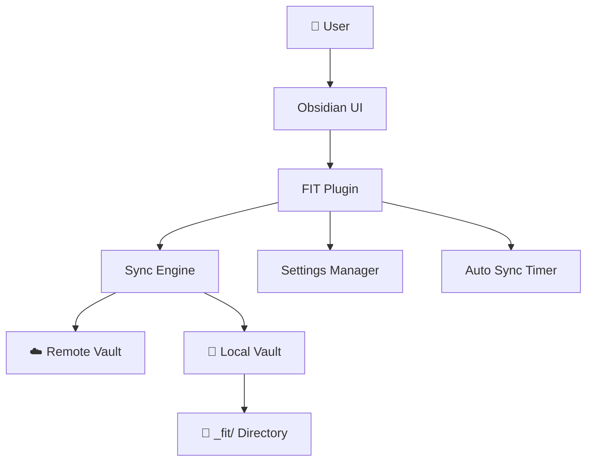
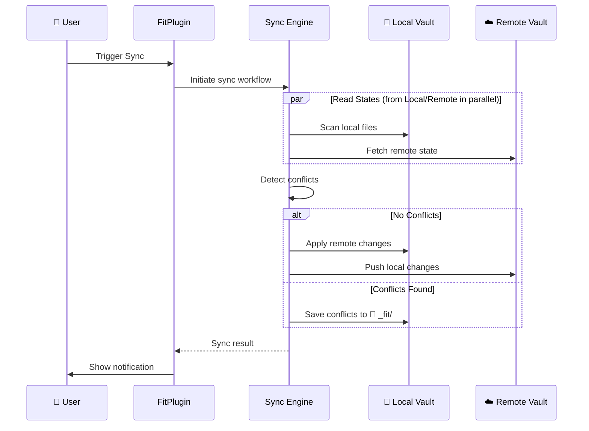

# FIT Architecture

High-level system design for the FIT (File gIT) Obsidian plugin.

## System Overview

FIT enables bidirectional sync between Obsidian vaults and remote git repositories (currently GitHub) with conflict resolution and cross-platform support.



## Core Components

### FitPlugin (main.ts)
**Purpose**: Plugin orchestrator and lifecycle manager (interfaces with 👤 user)
- Manages plugin loading, settings persistence, auto-sync scheduling
- Coordinates between sync engine and Obsidian UI
- Handles error recovery and user notifications

### Vault Abstractions (IVault)
**Purpose**: Abstract file operations (read/write) for different storage backends

A "vault" represents a complete collection of synced files, whether stored locally (Obsidian vault) or remotely (GitHub repository).

- **IVault Interface**: Common interface for vault operations
  - **Read operations**: `readFromSource()`, `readFileContent(path)`
  - **Write operations**: `applyChanges(filesToWrite, filesToDelete)` - batch operations
  - **Metadata**: `shouldTrackState(path)` - filter paths during sync

- **💾 LocalVault**: Obsidian vault implementation
  - Computes SHA-1 hashes from vault files
  - Owns local state
  - Batch file operations via `applyChanges()`

- **☁️ RemoteGitHubVault**: GitHub repository implementation
  - Fetches remote tree state via GitHub API
  - Owns remote state
  - Creates commits via `applyChanges()` (creates blobs, builds trees, creates commits, updates refs)
  - Handles empty repository case

### Sync Engine (fitSync.ts, fit.ts)
**Purpose**: Core synchronization logic
- **Fit**: Coordinator between vaults with clean abstractions
  - Owns 💾 LocalVault and ☁️ RemoteVault instances (currently RemoteGitHubVault)
  - Provides `getLocalChanges()` / `getRemoteChanges()` abstractions
  - Implements sync policy via `shouldSyncPath()` (ignores paths like 📁 `_fit/` and `.obsidian/`)
  - Detects clashes between local and remote changes via `getClashedChanges()`

- **FitSync**: High-level sync workflow and 🔀 conflict resolution
  - Orchestrates unified bidirectional sync with 🔀 conflict handling
  - All clash detection happens inline at the start of sync
  - Phases: detect clashes → batch stat filesystem → resolve conflicts → push → pull → persist
  - Handles both sync and push-only operations

**Remote Backend Integration**:
- Current implementation: RemoteGitHubVault using `@octokit/core` with automatic retry handling
- Architecture supports adding RemoteGitLabVault, RemoteGiteaVault, etc. via IVault interface

### Support Systems
- **FitLogger**: Cross-platform diagnostic logging (enabled by default, writes to `.obsidian/plugins/fit/debug.log`)
- **Settings UI**: GitHub authentication and configuration management
- **Notifications**: User feedback during sync operations

## Data Flow

### Sync Process



### Change Detection Strategy

**SHA-based Comparison**: Files are compared using SHA hashes rather than timestamps
- **Local Cache**: Tracks SHA of each file from last sync
- **Remote Cache**: Tracks SHA of each remote file from last fetch
- **Incremental Sync**: Only processes files that have changed since last sync

**Benefits**:
- Network efficient (only changed files transferred)
- Handles clock skew between devices
- Reliable conflict detection

📘 **For detailed sync logic, decision trees, conflict resolution, and debugging guide, see [Sync Logic Deep Dive](./sync-logic.md)**

## Storage Architecture

### 📦 Plugin Data
```
.obsidian/plugins/fit/data.json (plain text):
├── settings
│   ├── 🔒 pat (GitHub Personal Access Token)
│   ├── owner, repo, branch
│   ├── deviceName, avatarUrl
│   ├── autoSync preferences
│   └── notification settings
└── localStore (sync state cache)
    ├── localSha (file path -> SHA map)
    ├── lastFetchedCommitSha
    └── lastFetchedRemoteSha (remote file path -> SHA map)

.obsidian/plugins/fit/debug.log:
└── Debug logs (when enabled in settings)
```

### 💾 Vault Structure
```
Obsidian Vault:
├── [user files and folders]
└── 📁 _fit/                 # Conflict resolution directory
    ├── conflicted-file.md   # Remote version of conflicted files
    └── subfolder/
        └── another-conflict.md
```

**Note**: Conflicted files are saved directly in 📁 `_fit/` with the same path structure as the original, containing the remote version. The local version remains in the original location.

## 🔒 Security Model

### Data Protection
- **Credentials**: GitHub PAT stored in 📦 plugin data (currently in plain text)
- **API Security**: All remote API calls use HTTPS with proper authentication
- **Local Storage**: No sensitive data in logs or temporary files

### 🔀 Conflict Handling
- **Non-destructive**: Original files never overwritten during conflicts
- **User Control**: All conflict resolution is manual and user-directed
- **Audit Trail**: Conflicted files preserved in 📁 `_fit/` with timestamps

## Performance Characteristics

### Optimization Strategies
- **Incremental Sync**: SHA-based change detection minimizes data transfer
- **Caching**: Local and remote SHA caches avoid redundant API calls

### Scalability Considerations
- **Large Repositories**: Handles 1000+ files through paginated API calls
- **Large Files**: Supports files up to GitHub's 100MB limit
- **Rate Limiting**: Handled automatically by GitHub API client

## Extension Points

### Adding Sync Backends
Implement the `IVault` interface to support additional remote backends:

```typescript
interface IVault {
    // Read operations
    readFromSource(): Promise<VaultReadResult>;
    readFileContent(path: string): Promise<FileContent>;

    // Write operations
    applyChanges(
        filesToWrite: Array<{path: string, content: FileContent}>,
        filesToDelete: Array<string>
    ): Promise<FileOpRecord[]>;

    // Metadata
    shouldTrackState(path: string): boolean;
}
```

**Example**: Create `RemoteGitLabVault` by:
1. Implement `IVault` interface
2. Use GitLab API to fetch repository tree in `readFromSource()`
3. Compute SHA hashes from GitLab blobs
4. Handle GitLab-specific path filtering in `shouldTrackState()`
5. Implement commit operations in `applyChanges()`

**Current implementations**:
- `LocalVault`: Obsidian vault
- `RemoteGitHubVault`: GitHub repositories

### Custom Conflict Resolution
Extend `FitSync` class to implement custom conflict resolution strategies:
- Auto-merge for specific file types
- Integration with external diff tools
- Custom conflict markers or formats

### Enhanced Notifications
Extend notification system for:
- Integration with other Obsidian plugins
- Desktop notifications outside Obsidian
- Detailed sync reports and statistics

## Design Principles

### Reliability First
- All operations are transactional where possible
- User data is never lost during sync conflicts
- Graceful degradation when network/API issues occur
- Error scenarios should clearly communicate problems to users so they can resolve problems

### 👤 User Agency
- Users maintain full control over conflict resolution
- Clear feedback about what changes will occur
- Easy rollback through git history

### Cross-Platform Consistency
- Identical behavior on desktop and mobile Obsidian
- Platform-agnostic file handling and sync logic
- Consistent UI patterns across environments
