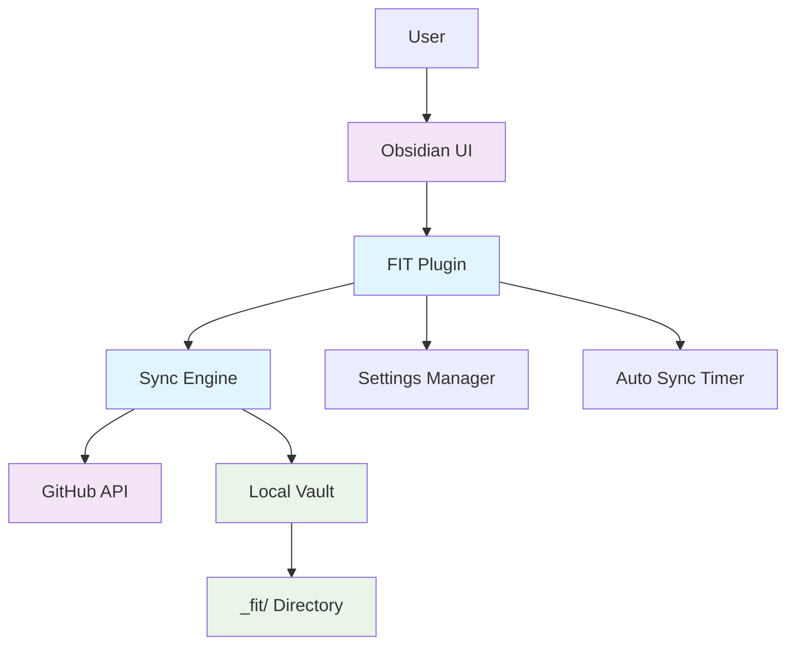
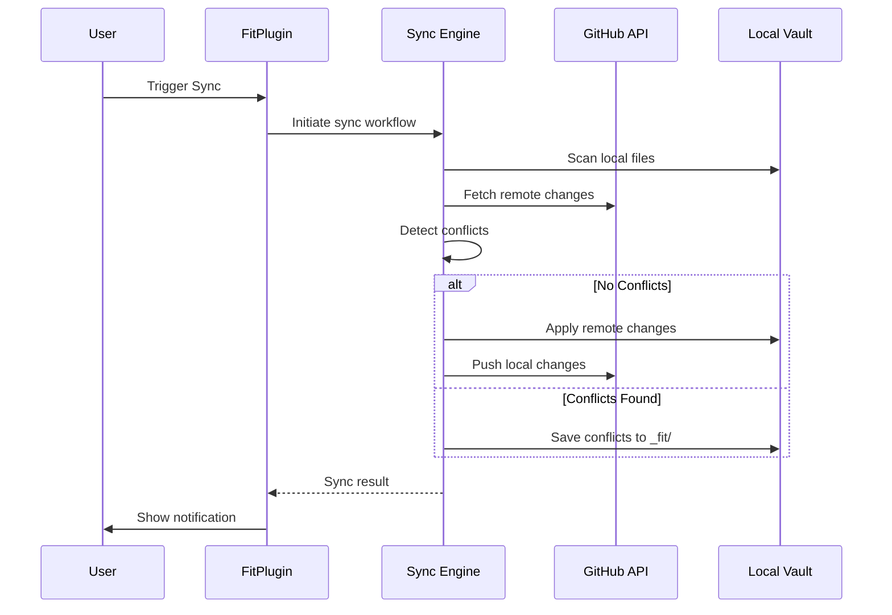

# FIT Architecture

High-level system design for the FIT (File gIT) Obsidian plugin.

## System Overview

FIT enables bidirectional sync between Obsidian vaults and GitHub repositories with conflict resolution and cross-platform support.



## Core Components

### FitPlugin (main.ts)
**Purpose**: Plugin orchestrator and lifecycle manager
- Manages plugin loading, settings persistence, auto-sync scheduling
- Coordinates between sync engine and Obsidian UI
- Handles error recovery and user notifications

### Vault Abstractions (IVault)
**Purpose**: Abstract file operations (read/write) for different storage backends

A "vault" represents a complete collection of synced files, whether stored locally (Obsidian vault) or remotely (GitHub repository).

- **IVault**: Common interface for vault operations
  - **Read operations**: `computeCurrentState()`, `getChanges(baseline)`, `readFileContent(path)`
  - **Write operations**: `writeFile()`, `deleteFile()`, `applyChanges()`
  - **Metadata**: `shouldTrackState(path)` - Filter paths during sync

- **LocalVault**: Obsidian vault implementation (fully implemented)
  - Computes SHA hashes from vault files
  - Filters ignored paths (`_fit/`, hidden files like `.obsidian/`)
  - Encapsulates Obsidian Vault API quirks
  - Integrated into Fit class for local state detection

- **RemoteGitHubVault**: GitHub repository implementation
  - Fetches remote tree via Octokit
  - Future: RemoteGitLabVault, RemoteGiteaVault

### Sync Engine (fit.ts, fitSync.ts)
**Purpose**: Core synchronization logic
- **Fit**: GitHub API operations via Octokit, conflict identification
  - Uses LocalVault for local state detection
  - Will use RemoteGitHubVault for remote operations (Phase 3)
- **FitSync**: High-level sync workflow coordination and conflict resolution

**GitHub API Integration**:
- Uses `@octokit/core` for all GitHub API communications with automatic retry handling

### Support Systems
- **Settings UI**: GitHub authentication and configuration management
- **Notifications**: User feedback during sync operations

## Data Flow

### Sync Process



### Change Detection Strategy

**SHA-based Comparison**: Files are compared using SHA hashes rather than timestamps
- **Local Cache**: Tracks SHA of each file from last sync
- **Remote Cache**: Tracks SHA of each remote file from last fetch
- **Incremental Sync**: Only processes files that have changed since last sync

**Benefits**:
- Network efficient (only changed files transferred)
- Handles clock skew between devices
- Reliable conflict detection

📘 **For detailed sync logic, decision trees, conflict resolution, and debugging guide, see [Sync Logic Deep Dive](./sync-logic.md)**

## Storage Architecture

### Plugin Data
```
.obsidian/plugins/fit/data.json (plain text):
├── settings
│   ├── pat (GitHub Personal Access Token)
│   ├── owner, repo, branch
│   ├── deviceName, avatarUrl
│   ├── autoSync preferences
│   └── notification settings
└── localStore (sync state cache)
    ├── localSha (file path -> SHA map)
    ├── lastFetchedCommitSha
    └── lastFetchedRemoteSha (remote file path -> SHA map)
```

### Vault Structure
```
Obsidian Vault:
├── [user files and folders]
└── _fit/                    # Conflict resolution directory
    ├── conflicted-file.md   # Remote version of conflicted files
    └── subfolder/
        └── another-conflict.md
```

**Note**: Conflicted files are saved directly in `_fit/` with the same path structure as the original, containing the remote version. The local version remains in the original location.

## Security Model

### Data Protection
- **Credentials**: GitHub PAT stored in plugin data (currently in plain text)
- **API Security**: All GitHub API calls use HTTPS with proper authentication
- **Local Storage**: No sensitive data in logs or temporary files

### Conflict Handling
- **Non-destructive**: Original files never overwritten during conflicts
- **User Control**: All conflict resolution is manual and user-directed
- **Audit Trail**: Conflicted files preserved with timestamps

## Performance Characteristics

### Optimization Strategies
- **Incremental Sync**: SHA-based change detection minimizes data transfer
- **Caching**: Local and remote SHA caches avoid redundant API calls

### Scalability Considerations
- **Large Repositories**: Handles 1000+ files through paginated API calls
- **Large Files**: Supports files up to GitHub's 100MB limit
- **Rate Limiting**: Handled automatically by GitHub API client

## Extension Points

### Adding Sync Backends
Implement the `IVault` interface to support additional remote backends:
```typescript
interface IVault {
    // Read operations
    computeCurrentState(): Promise<FileState>  // FileState = Record<path, sha>
    getChanges(baselineState: FileState): Promise<StateChange[]>
    readFileContent(path: string): Promise<string>

    // Write operations
    writeFile(path: string, content: string): Promise<FileOpRecord>
    deleteFile(path: string): Promise<FileOpRecord>
    applyChanges(filesToWrite, filesToDelete): Promise<FileOpRecord[]>

    // Metadata
    shouldTrackState(path: string): boolean
}
```

**Example**: Create `RemoteGitLabVault` by:
1. Implementing `IVault`
2. Using GitLab API to fetch repository tree
3. Computing SHA hashes from GitLab blobs
4. Handling GitLab-specific path filtering
5. Implementing push/commit operations for write methods

**Current implementations**:
- `RemoteGitHubVault`: GitHub repositories (stub, implementation in Phase 3)
- `LocalVault`: Obsidian vault (fully implemented - read operations complete, write operations via VaultOperations)

### Custom Conflict Resolution
Extend `FitSync` class to implement custom conflict resolution strategies:
- Auto-merge for specific file types
- Integration with external diff tools
- Custom conflict markers or formats

### Enhanced Notifications
Extend notification system for:
- Integration with other Obsidian plugins
- Desktop notifications outside Obsidian
- Detailed sync reports and statistics

## Design Principles

### Reliability First
- All operations are transactional where possible
- User data is never lost during sync conflicts
- Graceful degradation when network/API issues occur
- Error scenarios should clearly communicate problems to users so they can resolve problems

### User Agency
- Users maintain full control over conflict resolution
- Clear feedback about what changes will occur
- Easy rollback through git history

### Cross-Platform Consistency
- Identical behavior on desktop and mobile Obsidian
- Platform-agnostic file handling and sync logic
- Consistent UI patterns across environments
