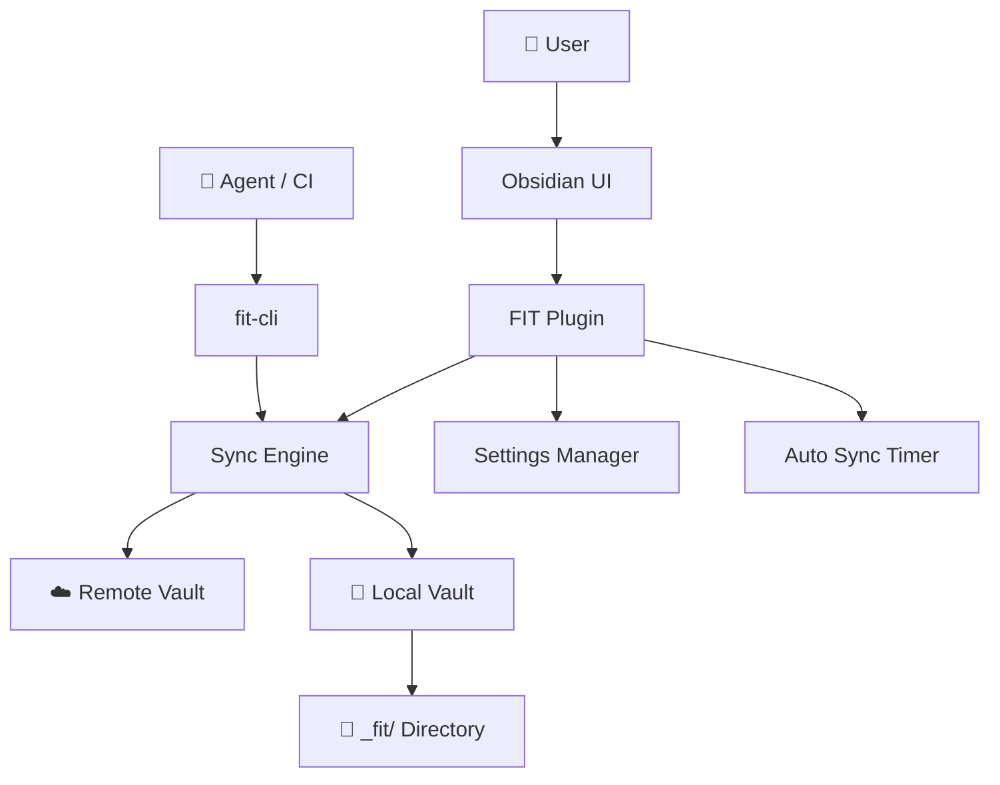
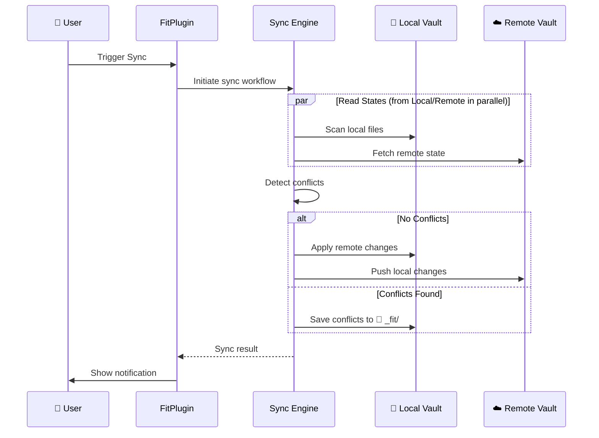

# FIT Architecture

High-level system design for the FIT (File gIT) Obsidian plugin.

## System Overview

FIT enables bidirectional sync between Obsidian vaults and remote git repositories (currently GitHub) with conflict resolution and cross-platform support.


```mermaid
graph TB
    User[👤 User] --> Obsidian[Obsidian UI]
    Agent[🤖 Agent / CI] --> CLI[fit-cli]
    Obsidian --> FitPlugin[FIT Plugin]

    FitPlugin --> Sync[Sync Engine]
    FitPlugin --> Settings[Settings Manager]
    FitPlugin --> AutoSync[Auto Sync Timer]
    CLI --> Sync

    Sync --> Remote[☁️ Remote Vault]
    Sync --> Vault[💾 Local Vault]

    Vault --> ConflictDir[📁 _fit/ Directory]
```

## Core Components

### FitPlugin (main.ts)
**Purpose**: Plugin orchestrator and lifecycle manager (interfaces with 👤 user)
- Manages plugin loading, settings persistence, auto-sync scheduling
- Coordinates between sync engine and Obsidian UI
- Handles error recovery and user notifications

### fit-cli (src/cli/index.ts)
**Purpose**: Command-line entry point for automation and CI pipelines (interfaces with 🤖 agent/CI)
- Exposes the same sync engine as the plugin via `sync` and `status` subcommands
- Config layered from `~/.fit-cli.json` → environment variables → CLI flags
- Uses `NodeLocalVault` for filesystem access and `CliNotice` for stderr progress output
- State (SHA caches) persisted to `<vault>/.fit-state.json`
- Built as a separate CJS bundle (`fit-cli.cjs`) via `npm run cli:build`

### Vault Abstractions (IVault, ILocalVault)
**Purpose**: Abstract file operations (read/write) for different storage backends

A "vault" represents a complete collection of synced files, whether stored locally (Obsidian vault or filesystem directory) or remotely (GitHub repository).

- **IVault Interface**: Common interface for vault operations
  - **Read operations**: `readFromSource()`, `readFileContent(path)`
  - **Write operations**: `applyChanges(filesToWrite, filesToDelete)` - batch operations
  - **Metadata**: `shouldTrackState(path)` - filter paths during sync

- **ILocalVault Interface**: Extends `IVault<"local">` with local-specific operations
  - `statPaths(paths)` — batch filesystem stat used by sync engine during conflict resolution
  - Implemented by both `LocalVault` (Obsidian) and `NodeLocalVault` (CLI/Node.js)

- **💾 LocalVault**: Obsidian vault implementation
  - Computes SHA-1 hashes from vault files (delegates to `computeFileSha1` utility)
  - Owns local state
  - Batch file operations via `applyChanges()`

- **💾 NodeLocalVault**: Node.js filesystem implementation (CLI)
  - Same `ILocalVault` contract as `LocalVault` but implemented with `fs/promises`
  - No Obsidian dependency — usable in any Node.js environment
  - Same hidden-file exclusion policy and binary-detection heuristics as `LocalVault`

- **☁️ RemoteGitHubVault**: GitHub repository implementation
  - Fetches remote tree state via GitHub API
  - Owns remote state
  - Creates commits via `applyChanges()` (creates blobs, builds trees, creates commits, updates refs)
  - Handles empty repository case

### SHA Algorithms and Change Detection

**CRITICAL: Local and Remote SHAs are INCOMPATIBLE**

FIT uses different SHA algorithms for local and remote file tracking:

- **Local SHA** (`LocalVault.fileSha1`): `SHA1(normalizedPath + content)`
  - Used for detecting local changes between syncs
  - Stored in `localSha` cache (part of LocalStores in data.json)
  - Custom algorithm designed for consistent cross-platform hashing
  - Does NOT match Git's blob SHA format

- **Remote SHA** (from GitHub API): Git blob SHA format `SHA1("blob " + size + "\0" + content)`
  - Used for detecting remote changes between syncs
  - Stored in `lastFetchedRemoteSha` cache (part of LocalStores in data.json)
  - Standard Git blob object format
  - Computed by GitHub when files are committed

**Why different algorithms?**
- Local SHA predates understanding of Git blob format
- Changing local SHA algorithm would invalidate all existing caches
- Local SHA includes path in hash (helps with Unicode normalization tracking, issue #51)
- Both algorithms serve the same purpose: detect when file content changed

**Important consequences:**
- ❌ **NEVER compare local SHA directly with remote SHA** - they will never match even for identical files
- ❌ **NEVER copy remote SHA into localSha** - will break change detection
- ✅ When recording baseline for remote content, always compute using `LocalVault.fileSha1()`
- ✅ Each SHA cache uses its own algorithm consistently

**Code references:**
- Local SHA: [src/util/fileHashUtils.ts `computeFileSha1()`](../src/util/fileHashUtils.ts)
- Algorithm note: [src/util/hashing.ts:22](../src/util/hashing.ts#L22)
- Baseline recording: [src/fitSync.ts:538-547](../src/fitSync.ts#L538)

### Sync Engine (fitSync.ts, fit.ts)
**Purpose**: Core synchronization logic
- **Fit**: Coordinator between vaults with clean abstractions
  - Owns 💾 LocalVault and ☁️ RemoteVault instances (currently RemoteGitHubVault)
  - Provides `getLocalChanges()` / `getRemoteChanges()` abstractions
  - Implements sync policy via `shouldSyncPath()` (ignores paths like 📁 `_fit/` and `.obsidian/`)
  - Detects clashes between local and remote changes via `getClashedChanges()`

- **FitSync**: High-level sync workflow and 🔀 conflict resolution
  - Orchestrates unified bidirectional sync with 🔀 conflict handling
  - All clash detection happens inline at the start of sync
  - Phases: detect clashes → batch stat filesystem → resolve conflicts → push → pull → persist
  - Handles both sync and push-only operations

**Remote Backend Integration**:
- Current implementation: GitHub backend with two components:
  - `GitHubConnection`: PAT-based operations (authentication, repo/branch discovery) for settings UI
  - `RemoteGitHubVault`: Repository-specific sync operations using `@octokit/core` with automatic retry handling
- Architecture supports adding GitLab/Gitea backends via IVault interface (would require corresponding connection classes)

### Support Systems
- **FitLogger**: Cross-platform diagnostic logging (enabled by default, writes to `.obsidian/plugins/fit/debug.log` for the plugin; to stdout for the CLI)
- **Settings UI**: GitHub authentication and configuration management (plugin only)
- **Notifications**: User feedback during sync operations (`FitNotice` for Obsidian UI, `CliNotice` for stderr in the CLI)

## Data Flow

### Sync Process


```mermaid
sequenceDiagram
    participant User as 👤 User
    participant Plugin as FitPlugin
    participant Sync as Sync Engine
    participant Local as 💾 Local Vault
    participant Remote as ☁️ Remote Vault

    User->>Plugin: Trigger Sync
    Plugin->>Sync: Initiate sync workflow

    par Read States (from Local/Remote in parallel)
        Sync->>Local: Scan local files
        Sync->>Remote: Fetch remote state
    end

    Sync->>Sync: Detect conflicts

    alt No Conflicts
        Sync->>Local: Apply remote changes
        Sync->>Remote: Push local changes
    else Conflicts Found
        Sync->>Local: Save conflicts to 📁 _fit/
    end

    Sync-->>Plugin: Sync result
    Plugin->>User: Show notification
```

### Change Detection Strategy

**SHA-based Comparison**: Files are compared using SHA hashes rather than timestamps
- **Local Cache**: Tracks SHA of each file from last sync
- **Remote Cache**: Tracks SHA of each remote file from last fetch
- **Incremental Sync**: Only processes files that have changed since last sync

**Benefits**:
- Network efficient (only changed files transferred)
- Handles clock skew between devices
- Reliable conflict detection

📘 **For detailed sync logic, decision trees, conflict resolution, and debugging guide, see [Sync Logic Deep Dive](./sync-logic.md)**

## Storage Architecture

### 📦 Plugin Data
```
.obsidian/plugins/fit/data.json (plain text):
├── settings
│   ├── 🔒 pat (GitHub Personal Access Token)
│   ├── owner, repo, branch
│   ├── deviceName, avatarUrl
│   ├── autoSync preferences
│   └── notification settings
└── localStore (sync state cache)
    ├── localSha (file path -> SHA map)
    ├── lastFetchedCommitSha
    └── lastFetchedRemoteSha (remote file path -> SHA map)

.obsidian/plugins/fit/debug.log:
└── Debug logs (when enabled in settings)
```

### 🖥️ CLI State
```
<vault>/.fit-state.json (default location, configurable via --state):
└── localStore (sync state cache — same schema as plugin data.json localStore)
    ├── localSha (file path -> SHA map)
    ├── lastFetchedCommitSha
    └── lastFetchedRemoteSha (remote file path -> SHA map)
```

**Note**: The CLI state file uses the same `LocalStores` schema as the plugin, ensuring SHA caches from either tool are compatible.

### 💾 Vault Structure
```
Obsidian Vault:
├── [user files and folders]
└── 📁 _fit/                 # Conflict resolution directory
    ├── conflicted-file.md   # Remote version of conflicted files
    └── subfolder/
        └── another-conflict.md
```

**Note**: Conflicted files are saved directly in 📁 `_fit/` with the same path structure as the original, containing the remote version. The local version remains in the original location.

## 🔒 Security Model

### Data Protection
- **Credentials**: GitHub PAT stored in 📦 plugin data (currently in plain text)
- **API Security**: All remote API calls use HTTPS with proper authentication
- **Local Storage**: No sensitive data in logs or temporary files

### 🔀 Conflict Handling
- **Non-destructive**: Original files never overwritten during conflicts
- **User Control**: All conflict resolution is manual and user-directed
- **Audit Trail**: Conflicted files preserved in 📁 `_fit/` with timestamps

## Performance Characteristics

### Optimization Strategies
- **Incremental Sync**: SHA-based change detection minimizes data transfer
- **Caching**: Local and remote SHA caches avoid redundant API calls

### Scalability Considerations
- **Large Repositories**: Handles 1000+ files through paginated API calls
- **Large Files**: Supports files up to GitHub's 100MB limit
- **Rate Limiting**: Handled automatically by GitHub API client

## Extension Points

### Adding Sync Backends
Implement the `IVault` interface to support additional remote backends, or `ILocalVault` to support additional local backends:

```typescript
// Remote backend (IVault<"remote">)
interface IVault {
    // Read operations
    readFromSource(): Promise<VaultReadResult>;
    readFileContent(path: string): Promise<FileContent>;

    // Write operations
    applyChanges(
        filesToWrite: Array<{path: string, content: FileContent}>,
        filesToDelete: Array<string>
    ): Promise<FileOpRecord[]>;

    // Metadata
    shouldTrackState(path: string): boolean;
}

// Local backend (ILocalVault extends IVault<"local">)
interface ILocalVault extends IVault<"local"> {
    statPaths(paths: string[]): Promise<Map<string, 'file' | 'folder' | null>>;
}
```

**Example**: Create `RemoteGitLabVault` by:
1. Implement `IVault` interface
2. Use GitLab API to fetch repository tree in `readFromSource()`
3. Compute SHA hashes from GitLab blobs
4. Handle GitLab-specific path filtering in `shouldTrackState()`
5. Implement commit operations in `applyChanges()`

**Current implementations**:
- `LocalVault`: Obsidian vault (requires Obsidian runtime)
- `NodeLocalVault`: Node.js filesystem vault (CLI / any Node.js environment)
- `RemoteGitHubVault`: GitHub repositories

### Custom Conflict Resolution
Extend `FitSync` class to implement custom conflict resolution strategies:
- Auto-merge for specific file types
- Integration with external diff tools
- Custom conflict markers or formats

### Enhanced Notifications
Extend notification system for:
- Integration with other Obsidian plugins
- Desktop notifications outside Obsidian
- Detailed sync reports and statistics

## Design Principles

### Reliability First
- All operations are transactional where possible
- User data is never lost during sync conflicts
- Graceful degradation when network/API issues occur
- Error scenarios should clearly communicate problems to users so they can resolve problems

### 👤 User Agency
- Users maintain full control over conflict resolution
- Clear feedback about what changes will occur
- Easy rollback through git history

### Cross-Platform Consistency
- Identical sync behaviour between the Obsidian plugin and `fit-cli`
- Platform-agnostic file handling and sync logic
- Consistent UI patterns across environments
