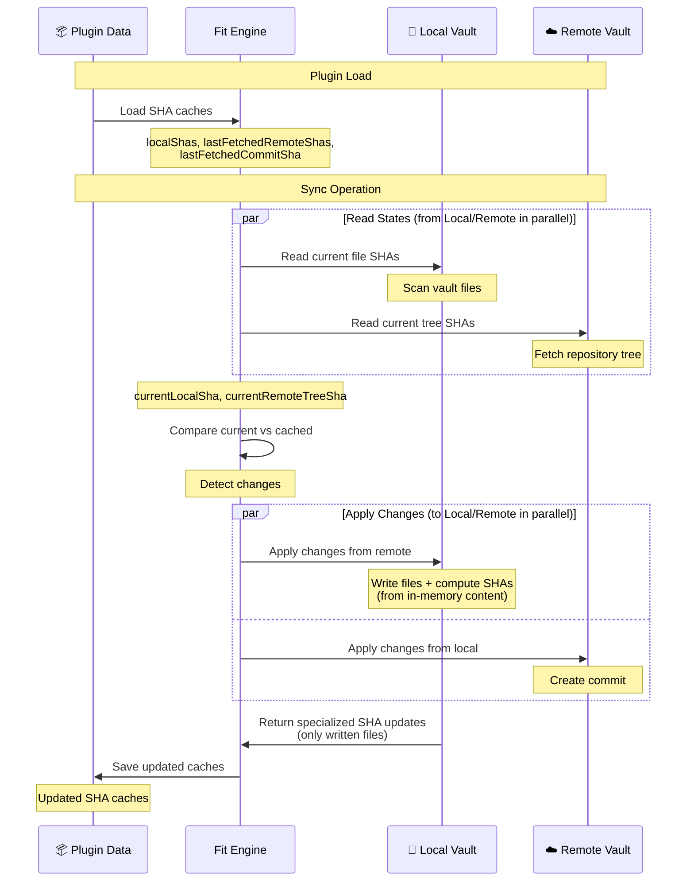
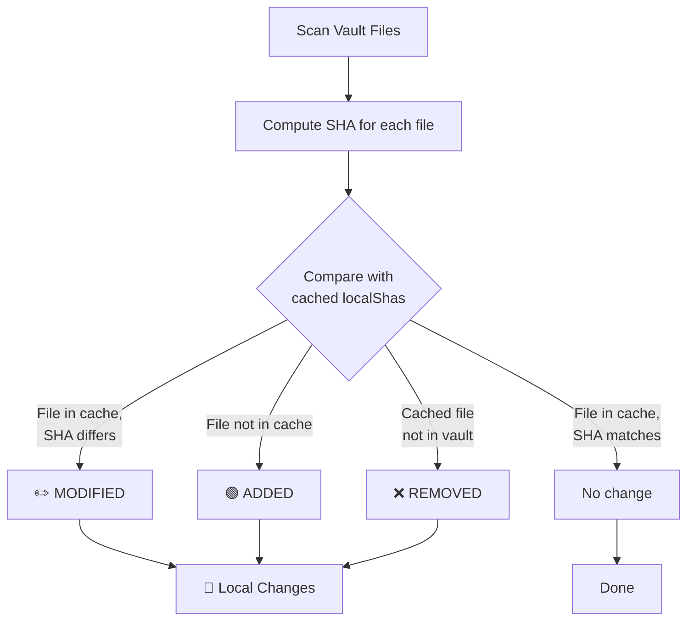
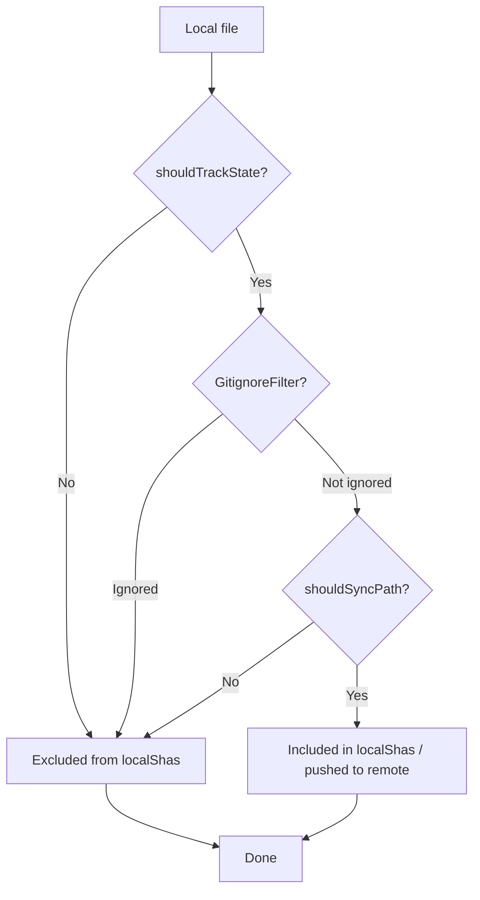
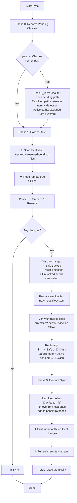
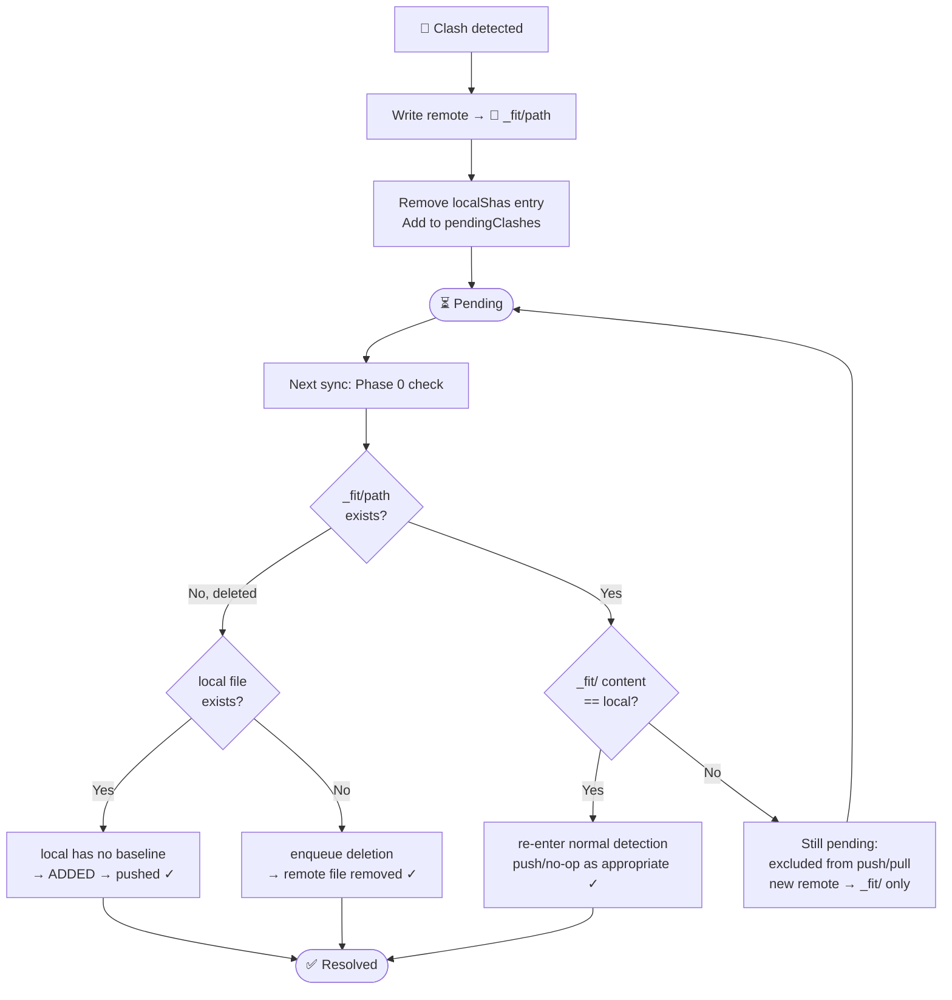
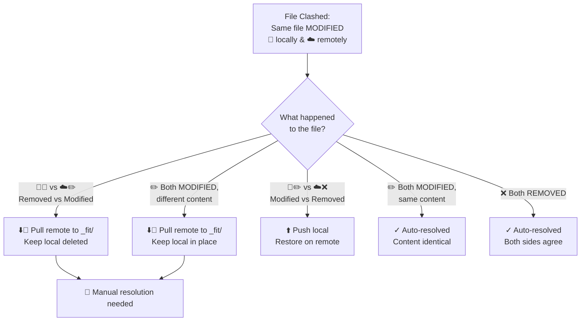
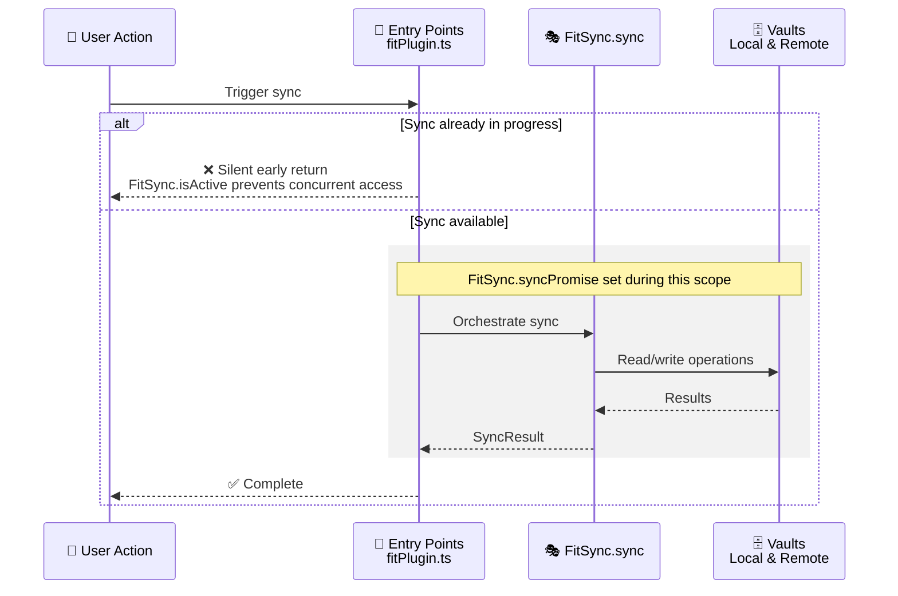

# Sync Logic Deep Dive

**For high-level architecture, see [Architecture Overview](./architecture.md)**
**For a scenario-by-scenario correctness decision table (what's tested, what's a known gap), see [Sync Scenario Matrix](./sync-scenario-matrix.md)**

This document explains the detailed sync logic in FIT - the nuts and bolts of how decisions are made. Use this guide when:
- 🐛 Debugging sync issues (e.g., "file recreated instead of deleted")
- 🔍 Understanding why a specific sync decision was made
- 📊 Reading debug logs to diagnose problems
- 🛠️ Contributing to sync logic improvements

**Emoji Key:**
- **Components:** 💾 Local Vault • ☁️ Remote Vault • 📦 Cache/Storage • 📁 `_fit/` Directory
- **Operations:** ⬆️ Push • ⬇️ Pull • 🔀 Conflict
- **File Status:** 🟢 Added • ✏️ Modified • ❌ Removed

## 📦 SHA Cache System

FIT uses SHA-based change detection to maintain **baseline state** versions (`LocalStores` - persisted to disk):

  - `localShas`, `lastFetchedRemoteShas`, `lastFetchedCommitSha`
  - Reference point from last **successful** sync
  - Updated only on sync success

**Flow**: Fit queries vault latest known states → compares to baseline → detects changes → executes sync → updates baseline on success.

**Critical**: Baseline updates only on successful sync. Failed syncs preserve baseline, so next sync detects all accumulated changes.

### Why SHA Comparison?

**Problem with timestamps:**
- Clock skew between devices
- Unreliable on mobile platforms
- Lost when files are copied/restored

**SHA advantages:**
- Content-based comparison
- Handles clock differences
- Detects actual changes vs metadata changes
- Enables three-way merge detection

### Cache Structure

```typescript
{
  localShas: {
    "file1.md": "abc123...",
    "file2.md": "def456..."
  },
  lastFetchedRemoteShas: {
    "file1.md": "abc123...",
    "file3.md": "ghi789..."
  },
  lastFetchedCommitSha: "commit-sha-xyz..."
}
```

This is the core of the cache. The full set of persisted fields (pending clashes, unpushed files, last sync time, legacy migration fields) is documented in [`src/localStores.ts`](../src/localStores.ts).

### SHA Cache Lifecycle


```mermaid
sequenceDiagram
    participant Storage as 📦 Plugin Data
    participant Fit as Fit Engine
    participant Local as 💾 Local Vault
    participant Remote as ☁️ Remote Vault

    Note over Storage,Remote: Plugin Load
    Storage->>Fit: Load SHA caches
    Note over Fit: localShas, lastFetchedRemoteShas,<br/>lastFetchedCommitSha

    Note over Storage,Remote: Sync Operation
    par Read States (from Local/Remote in parallel)
        Fit->>Local: Read current file SHAs
        Note over Local: Scan vault files
        Fit->>Remote: Read current tree SHAs
        Note over Remote: Fetch repository tree
    end

    Note over Fit: currentLocalSha, currentRemoteTreeSha

    Fit->>Fit: Compare current vs cached
    Note over Fit: Detect changes

    par Apply Changes (to Local/Remote in parallel)
        Fit->>Local: Apply changes from remote
        Note over Local: Write files + compute SHAs<br/>(from in-memory content)
    and
        Fit->>Remote: Apply changes from local
        Note over Remote: Create commit
    end

    Local->>Fit: Return specialized SHA updates<br/>(only written files)
    Fit->>Storage: Save updated caches
    Note over Storage: Updated SHA caches
```

**Key optimization:** When pulling remote changes, LocalVault computes SHAs **during** file writes (from in-memory content), not by re-scanning the entire vault. This provides:
- **Better performance:** Avoids re-reading files from disk
- **Race condition safety:** SHAs computed from synced content, not concurrent user edits
- **Efficient updates:** Only written files get new SHAs, rest of cache unchanged

See [SHA Computation Strategy](#sha-computation-strategy) below for detailed rationale.

### Baseline Recording for Untracked Files (#169)

**Problem:** When `syncHiddenFiles = false`, hidden files are not tracked by `LocalVault.readFromSource()` but can still be changed remotely. Without baseline SHAs, they clash on every sync even when unchanged.

**Solution:** Record baseline SHAs for untracked files when they're written from remote:
- Direct writes: SHA computed during write (standard path)
- Clashed files: SHA computed from remote content even when written to `_fit/`

This enables future syncs to compare current local SHA vs baseline to determine if the file changed locally.

**CRITICAL:** Must use `LocalVault.fileSha1()` (canonical git blob SHA), NOT the raw SHA from the GitHub tree API. See [docs/architecture.md](./architecture.md) "SHA Algorithms and Change Detection".

**Note:** Reading hidden files for baseline comparison requires using `vault.adapter` API instead of `vault.getAbstractFileByPath()`. See [docs/api-compatibility.md](./api-compatibility.md) "Reading Untracked Files".

**Also covers git-as-mask reconciliation (#337/#67):** a `.obsidian/` path just reconciled untracked→tracked this same sync (`Fit.trackedForCurrentSync`) is deliberately not included in `Fit.trackedObsidianPaths()` (the list `LocalVault` proactively probes for hidden-path discovery) — it doesn't need to be. The reconcile block always either establishes a real baseline directly, or clears `lastFetchedRemoteShas[path]` to force that path to appear as a remote change this same sync; either way, this same #169 mechanism (`determineLocalChecksNeeded` in `src/util/changeTracking.ts`) independently stats and reads the path directly rather than trusting the local scan's discovery list, so a divergent local file still surfaces as an ordinary `_fit/` clash instead of being silently overwritten.

## Concepts and Invariants

### Baseline

Each file path has a **baseline** SHA in `localShas` (local) and `lastFetchedRemoteShas` (remote). A baseline entry for `path` means: *this was the confirmed state of the file after the last successful sync.* Change detection works by comparing the current scanned state against the baseline.

- Baselines are updated only on successful sync completion. A failed sync leaves them unchanged, so the next sync re-detects all accumulated changes.
- A path **absent** from `localShas` has no confirmed local baseline — either it was never synced, or a clash removed the entry (see [Pending](#pending) below).
- **A value only counts as a baseline if it was established by an actual confirmed sync under the *current* sync scope.** A value merely observed while a path was out of scope (excluded, ignored, not yet opted in) never counts, and doesn't become valid just because scope later changes to include it. Before any mechanism could move a path from out-of-scope to in-scope, this was true but vacuous — nothing could populate a baseline out-of-band. `obsidianSyncRules`' opt-in transition was the first such mechanism (see below) and is what made the out-of-band case reachable in practice. Any future mechanism with the same shape (a new selective-sync design, a settings change that widens what's tracked) needs the same guarantee: never auto-resolve using a baseline that predates the scope change.

### `_fit/` as scratchpad

The `_fit/` directory is **never part of the synced vault.** It is out-of-band storage where FIT places copies of remote file versions for conflict resolution:

1. **Conflict copies:** When both local and remote changed the same tracked file, the remote version is written to `_fit/path` for the user to inspect. The path enters `pendingClashes`.

- `_fit/path` is always a copy of a *remote* version, never the local version.
- The canonical local version of `path` is always at `path`, not at `_fit/path`.
- `_fit/` contents are excluded from sync in both directions (`shouldSyncPath` returns false).

### Pending

A path is **pending** when it has an unresolved `_fit/` copy — the user has not yet confirmed which version to keep. FIT tracks pending paths in `pendingClashes` (persisted in `LocalStores`).

- A pending path has no baseline: `localShas[path]` is absent. FIT makes no assumption about which version is canonical.
- FIT **shields** pending paths: excluded from push (local version is unconfirmed) and protected from remote overwrites (new remote versions go to `_fit/` only).
- A path leaves pending when the user resolves the discrepancy — deleting `_fit/path`, or editing either file until both copies match. See [Pending Clash State Machine](#pending-clash-state-machine).

## Change Detection

### 💾 Local Change Detection

FIT compares current local file SHAs against the cached `localShas` to detect changes since the last sync.


```mermaid
flowchart TD
    Start[Scan Vault Files] --> ComputeSHA[Compute SHA for each file]
    ComputeSHA --> Compare{Compare with<br/>cached localShas}

    Compare -->|File in cache,<br/>SHA differs| Modified[✏️ MODIFIED]
    Compare -->|File not in cache| Added[🟢 ADDED]
    Compare -->|Cached file<br/>not in vault| Removed[❌ REMOVED]
    Compare -->|File in cache,<br/>SHA matches| NoChange[No change]

    Modified --> Result[💾 Local Changes]
    Added --> Result
    Removed --> Result
    NoChange --> End[Done]
```

**Implementation:** [`compareFileStates()` in util/changeTracking.ts](../src/util/changeTracking.ts)

```typescript
// Example local change detection
currentLocalSha = {
  "file1.md": "abc123"  // File exists
  // file2.md is missing
}

cachedLocalSha = {
  "file1.md": "abc123",  // Same SHA
  "file2.md": "def456"   // Was cached
}

// Result: file2.md detected as REMOVED
```

**Phase 0 note:** Before this detection runs, Phase 0 pre-processing excludes active pending clash paths (files with an unresolved `_fit/` copy tracked in `pendingClashes`). They re-enter this detection once resolved.

### ☁️ Remote Change Detection

Same logic applies for remote changes, comparing `currentRemoteTreeSha` against `lastFetchedRemoteShas`.

**How the remote vault provides file states:**

The remote vault fetches the **current snapshot** of all files from the repository tree, not deltas. We then compare this snapshot to our cached state to detect changes.

```json
// Simplified GitHub API response from GET /repos/{owner}/{repo}/git/trees/{sha}
{
  "tree": [
    {"path": "file1.md", "sha": "abc123", "type": "blob"},
    {"path": "file3.md", "sha": "new789", "type": "blob"}
  ]
}
```

We transform this into a `FileState` object (path → SHA mapping) and compare:

```typescript
// Example remote change detection
currentRemoteTreeSha = {
  "file1.md": "abc123",
  "file3.md": "new789"  // New file
}

lastFetchedRemoteShas = {
  "file1.md": "old999",  // SHA changed
  "file2.md": "def456"   // No longer exists remotely
}

// Results from compareFileStates():
// - file1.md: MODIFIED (SHA changed)
// - file3.md: ADDED (not in cache)
// - file2.md: REMOVED (not in current remote)
```

### The Critical Assumption

**For change detection to work correctly, the SHA caches MUST accurately reflect the state after the last sync.**

If a cache becomes stale or corrupted:
- Deletions may not be detected
- Files might be recreated instead of deleted
- Conflicts might not be recognized

For example, if a local deletion happens while `localShas` has been lost, both the cache and the scan are empty for that path, so no deletion is detected and the remote file stays. See [Lost SHA Cache](#lost-sha-cache) and [Stale Deletion State](#stale-deletion-state).

## Path Filtering and Safety

FIT implements three layers of path filtering:

### 1. Protected Paths (`shouldSyncPath`) - Default Excluded

- **Filtered by:** `Fit.shouldSyncPath()`
- **Applied to:** Both ⬆️ local→remote and ⬇️ remote→local
- **Reason:** Protect critical system directories by default; other `.obsidian/` paths become tracked automatically once content for them exists in the remote git tree

**The trigger is git, not FIT.** There is no settings toggle, no "start syncing this file" action, no local opt-in of any kind. A `.obsidian/` path becomes tracked purely because content for it exists in the remote git tree — added via the GitHub web UI, `git`/`gh` CLI, or another device that's already syncing it. The very next sync on any device sees that content and starts considering the path for sync in both directions from then on. Direct consequence, accepted rather than special-cased: adding a new tracked path is inherently clash-prone if the content you add doesn't match what's already on your other devices — there's no reconciliation smoothing beyond the ordinary [Baseline](#baseline)/clash machinery for that first sync.

**Hard denylist, `Fit.isHardDenylistedPath()`** ([`src/util/protectedPaths.ts`](../src/util/protectedPaths.ts)) — checked before any tracked-content logic, wins unconditionally even for a path with matching remote git content and an explicit `.fitattributes.json` entry:
- Plugin-managed code assets — `main.js`, `manifest.json`, `styles.css` under any `.obsidian/plugins/<id>/`, including FIT's own — owned by Obsidian's plugin loader, not a preferences file at all; writing them via git-driven sync fights the plugin manager. This one *is* permanent — there's no "safe subset of fields" concept for a JS bundle, field-level masking doesn't change anything here.
- A plugin's `node_modules/` folder (`.obsidian/plugins/<id>/node_modules/`), which is never something to sync.

**FIT's own `<pluginDir>/data.json` is NOT on the hard denylist** — it gets `format:"json"` + `scope:"subset"` the same way any other protected path gets a default. `<pluginDir>` is resolved dynamically from the actual install dir, not a hardcoded literal, so this follows an alternate install name (e.g. `fit-dev`) correctly.

Two denylists apply, at different scopes (`src/util/protectedPaths.ts`):
- **`UNIVERSAL_SECRET_FIELD_DENYLIST`** (`pat`, `encryptionPassword`) — every `scope: "subset"` path, not just FIT's own file.
- **`FIT_OWN_SETTINGS_DENYLIST`** — additional fields, only for FIT's own data.json:
  - Connection identity (`githubHost`, `owner`, `repo`, `branch`, `deviceName`, `avatarUrl`) — `owner`/`repo`/`branch` identify the sync target itself, so a synced change could silently redirect a device's sync target.
  - All of `LocalStores` (per-device sync bookkeeping) — meaningless, actively corrupting, on any other device by construction.

`FitSync.resolveSubsetScopePath` strips both from the parsed remote object immediately after parsing, before push/pull/merge/clash-preview can see them.

**The denylist gates syncing, not tracking.** `resolveSyncFormat`/`resolveScope`/`isEligibleForTracking` don't consult it — own data.json resolves `scope:"full"` from an explicit config entry the same as any path would. The only thing that keeps that unreachable in practice is `readAndApplyFitAttributes` (below) rejecting such an entry before it reaches `fitAttributes`.

**An explicit `.fitattributes.json` entry targeting a non-configurable path is rejected, not silently overridden.** `readAndApplyFitAttributes` drops the entry and sets `fitAttributesWarning` naming the path — scoped to just that entry, not the whole file, since every other rule stays independently valid (unlike a genuinely malformed, unparseable file). Invalid rules are handled the same way (see "Malformed `.fitattributes.json`").

**`_fit/` is separately, unconditionally excluded** — a `path.startsWith("_fit/")` check in `shouldSyncPath` itself (`src/fit.ts`), not part of the hard denylist above (it's the conflict-resolution directory, not an `.obsidian/` path at all).

**Filetype defaults.** A tracked `.obsidian/` path with no `.fitattributes.json` entry gets a format from its extension: `.css`/`.md`/`.txt` → `format: "text"` (whole-file, opaque bytes, no merge attempt); `.json`/`.canvas` → `format: "json"`. Any other extension has no default and stays detection-only (logged, never read or written — see [Explain Sync Status](#explain-sync-status)) until an explicit entry gives it one. `.fitattributes.json`'s presence never causes tracking by itself; it only modulates how an already-tracked path (per git presence, above) is handled. See [`src/fitAttributes.ts`](../src/fitAttributes.ts) for the schema.

**A protected json path is eligible once `scope` resolves to a value.** `"subset"` (field-level masking — only the tracked git-blob's keys sync) is the default; `"full"` (whole-file, every key, via the same structural merge engine `.canvas` uses — [`src/util/jsonMerge.ts`](../src/util/jsonMerge.ts)) requires an explicit entry to opt in. `format: "text"` is the other way in — opaque whole-file bytes regardless of shape — and, like `scope: "full"`, always requires an explicit entry.

**Behavior for untracked or unsynced-format paths:**
- **⬆️ Local→Remote:** Never pushed
- **⬇️ Remote→Local:** Silently tracked — no write, no notice. Remote SHA recorded in `protectedPathShas[path]` (untracked paths) or in the ordinary baseline once the path is git-tracked but not yet format-eligible.
- **📦 SHA Caches:** Excluded from `localShas` while blocked.

**Why not treat as a clash?**
A "conflict" requires two parties with competing claims to the same file. A blocked path has no local ownership — remote is authoritative by definition, or the path isn't eligible for sync at all yet. Showing a conflict notice for every sync where remote has such a file is misleading and noisy.

**protectedPathShas:** `LocalStores.protectedPathShas` maps `path → last-seen remote SHA`, populated when a path shows up as a change while excluded. Cleared once reconciled below; otherwise passive/diagnostic only, not read by the reconcile step.

**Tracking transition (remote content appears for a previously-untracked path):**
At the start of each sync, FIT reconciles paths that are currently eligible (`Fit.isEligibleForTracking`), have no `localShas` baseline yet, have a known remote SHA (`lastFetchedRemoteShas`, rebuilt from the live remote tree every sync regardless of eligibility, so always current), and have no unresolved clash (`pendingClashes` — excluded since their missing baseline is deliberate, not "never synced"). That cached remote SHA is only ever *passively observed*, so per the [Baseline](#baseline) invariant it cannot be trusted the moment local turns out to disagree with it:
- Local file exists and matches: genuinely safe — set `localShas` (`lastFetchedRemoteShas` already matches) — no-op.
- Local file exists but differs: leave `localShas` unset, clear `lastFetchedRemoteShas`. Both sides show as newly ADDED, resolved as an ordinary clash (`_fit/`) — never an automatic direction.
- Local file absent: clear `lastFetchedRemoteShas[path]` so remote appears ADDED → downloaded and written (subject to the format gate — only if format-eligible).

The reconciled path set is also recorded for the remainder of *this* sync via `Fit.markTrackedForCurrentSync()` — a same-sync-only, unpersisted signal — because the "local file absent" branch above clears `lastFetchedRemoteShas[path]`, which would otherwise make `shouldSyncPath` flip back to untracked for the rest of the same sync and undo the reconciliation.

**Untracking (remote removes a previously-tracked git-mask path):** a REMOVED remote change with
no local edit is ambiguous (deletion vs. "stop syncing this path"), so `resolveAllChanges` leaves
the local file in place instead of auto-deleting it. Reported once, tagged MODIFIED with an
explanatory `note` (not REMOVED, since nothing was deleted), folded into the ordinary
`changeGroups` report (`showFileChanges`) rather than a separate sync-status notice.

### 2. Hidden Files (`shouldTrackState`) - Configurable

- **Filtered by:** `LocalVault.shouldTrackState()` (respects `syncHiddenFiles` setting)
- **Applied to:** 💾 Local vault only
- **Default:** Hidden files are synced (opt-out via Settings → Sync hidden files)

**Hidden files:** Any path component starting with `.` (e.g., `.gitignore`, `.env`)

**When `syncHiddenFiles = true` (default):**
- Local vault walks the vault with `adapter.list` on each sync as an overlay on Obsidian's `vault.getFiles()` index: it adds the unindexed hidden paths (the index omits them) and never re-reports an indexed path
- Paths the walk deliberately or unavoidably does not scan are covered in [Scan-time pruning vs. the stored baseline](#scan-time-pruning-vs-the-stored-baseline)
- Hidden files read via `vault.adapter.readBinary()` and tracked in `localShas` like any other file
- Subject to `.gitignore` filtering and `shouldSyncPath` policy as normal
- ⚠️ Clash copies (written to `_fit/`) won't appear in Obsidian's file explorer — requires desktop file manager to resolve

**When `syncHiddenFiles = false`:**
- Hidden paths excluded from `localShas` (can't reliably scan via Vault API)
- A remote hidden file is written directly when no local copy exists, and clashes to `_fit/` when one does (local state can't be baseline-checked)
- Local hidden files never pushed

**Note:** `shouldTrackState` controls LocalVault's scanning capability. Sync policy decisions (e.g. never push `.obsidian/`) are handled separately by `Fit.shouldSyncPath()`.

#### Scan-time pruning vs. the stored baseline

The unindexed-path walk (`collectUnindexedInDir`) does not scan three kinds of path. Each is reported as an orphaned scan prefix (`orphanedScanPrefixes: Set<string>`, derived fresh each scan, never persisted):

- **Pruned:** VCS metadata (`.git`, `.jj`, `.hg`, `.svn`, `.bzr`, matched as a whole path component, files as well as folders — a submodule's `.git` gitlink marker is a file) and a plugin's `node_modules/` (`.obsidian/plugins/*/node_modules`, path-scoped). Walking one costs a full recursive scan and can surface thousands of paths nobody means to sync.
- **Unlistable:** a path whose contents the adapter cannot list. Obsidian's desktop `list()` stats every entry and rejects the whole call when one fails (e.g. a dangling symlink inside the folder), so one bad entry hides that path and everything under it, but not its siblings. It is logged with the path and error (the failing entry may be a child of that path) and listed in the sync notice like the rate-limited and locally-failed file lists. If the vault root cannot be listed, the whole walk is skipped the same way and the root is reported as `/`, which stands for every hidden path.
- **Probably a symlink:** an unindexed non-hidden file or folder (the adapter lists it, the index lacks it). In Obsidian 1.13.4 the index skips every symlink (file or folder) while `adapter.list` follows them, so admitting it would sync flattened copies of the target (a link cycle yields a copy per nesting level). It is not admitted or walked into, only logged (`Ignoring unindexed non-hidden paths (likely symlinks, or not yet indexed)`). A real file or folder the index has not caught up with gets the same treatment for that sync and is picked up once indexed. Symlinks under a hidden path are still followed and flattened.

A skipped path is absent from the scan's state because it wasn't looked at, not because it was deleted. `Fit.getLocalChanges()` combines the prefixes with the state into a `ScanCoverage`, whose `statusOf(path)` is one of:
- **`present`:** the scan saw the path. This wins even under an orphaned prefix, so an ordinary note that Obsidian's index lists keeps syncing when its folder could not be listed.
- **`unknown`:** absent from the state and equal to or under an orphaned prefix. Out of scope for that sync in both directions.
- **`absent`:** the scan looked and it is not there.

Callers act only on `unknown`:
- **Local:** `Fit.getLocalChanges()` excludes it from both sides of `compareFileStates`, so it reads as neither present nor removed.
- **Remote:** `FitSync` drops remote changes to an `unknown` path. Applying one would act on a local state the scan never saw, e.g. a remote deletion removing a local edit nobody scanned.

Skipped paths that an earlier version synced stay on the remote and on disk untouched; they just stop participating.

### 3. Gitignore Patterns (`GitignoreFilter`) - User-Defined Exclusions

- **Filtered by:** `GitignoreFilter` in `LocalVault.readFromSource()`
- **Applied to:** 💾 Local vault only (before SHA computation)
- **Reason:** Respect user-defined exclusion rules, consistent with git behavior

**How it works:**
- Reads `.gitignore` files from the vault root and any ancestor directories of tracked files
- Uses the `ignore` package for standard gitignore pattern semantics (negation, directory patterns, etc.)
- Only probes paths derived from the tracked file set — no full filesystem scan

**Behavior:**
- Files matched by any applicable `.gitignore` are excluded from `localShas` and never pushed
- Patterns scope correctly: a `build/.gitignore` only affects files under `build/`
- If no `.gitignore` files exist, this layer is a no-op

**Example:**
```
# Root .gitignore
*.log
node_modules/

# Result: debug.log and node_modules/pkg/index.js excluded from sync
#         README.md, src/main.ts included as normal
```

**Implementation:** [`src/util/gitignore.ts` — `GitignoreFilter`](../src/util/gitignore.ts)

### Combined Filtering: `.obsidian/` Files

`.obsidian/` paths are excluded by `shouldSyncPath` unless git-tracked and format-eligible (see
[Protected Paths](#1-protected-paths-shouldsyncpath---default-excluded) and
[`.fitattributes.json`](#fitattributesjson) for which paths get which format). Untracked
ones are never synced in either direction: their remote SHA is only recorded passively, with no
download and no `_fit/` write, and they are filtered out before change detection.

A tracked, eligible path is synced like any regular file, and `syncHiddenFiles = false` does not
suppress it: `Fit.trackedObsidianPaths()` feeds `LocalVault.configure({trackedHiddenPaths})`, so
the local scan probes that known set directly even when the recursive hidden-file scan is off
(the same way `.fitattributes.json` itself is always discovered). A tracked path with no format
is detection-only: logged, never read or written. See [Explain Sync Status](#explain-sync-status).

### Implementation Locations

**Path filtering:**
- [`Fit.shouldSyncPath()`](../src/fit.ts) - Protected path check
- [`LocalVault.shouldTrackState()`](../src/localVault.ts) - Hidden file check (respects syncHiddenFiles setting)
- [`GitignoreFilter`](../src/util/gitignore.ts) - User-defined exclusions (local only)
- [`FitSync.sync()`](../src/fitSync.ts) - Filters local changes before sync
- [`FitSync.applyRemoteChanges()`](../src/fitSync.ts) - Handles remote protected/hidden files with safety checks

**Decision flow (local files):**

```mermaid
flowchart TD
    Start[Local file] --> Trackable{shouldTrackState?}
    Trackable -->|No| Skip[Excluded from localShas]
    Trackable -->|Yes| Gitignore{GitignoreFilter?}
    Gitignore -->|Ignored| Skip
    Gitignore -->|Not ignored| Protected{shouldSyncPath?}
    Protected -->|No| Skip
    Protected -->|Yes| Tracked[Included in localShas / pushed to remote]

    Skip --> End[Done]
    Tracked --> End
```

### Version Migration Safety

**Critical Risk:** When tracking capabilities change (version upgrade or setting toggle), cached state can become inconsistent with new scan behavior.

**Most dangerous scenario:** **Tracking REMOVED** (hidden file tracking disabled after being on)

**Realistic example:** User disables "Sync hidden files" setting after having synced hidden files.

```typescript
// syncHiddenFiles was true, .gitignore was tracked:
localShas = { ".gitignore": "abc123" }
lastFetchedRemoteShas = { ".gitignore": "abc123" }

// After setting disabled:
newScan = {}  // Vault API only — can't see hidden files
compareFileStates(newScan, localShas) // → reports ".gitignore" as REMOVED
// ⚠️ Risk: Plugin pushes deletion to remote → DATA LOSS
```

**Solution:** Before pushing ANY deletion, verify file is physically absent from filesystem:

```typescript
// In FitSync.compareAndResolveChanges()
// Phase 2b: Batch stat all paths needing verification (including deletions)
const pathsToStat = new Set<string>();
localChanges
  .filter(c => c.type === 'REMOVED')
  .forEach(c => pathsToStat.add(c.path));
const {existenceMap} = await this.collectFilesystemState(Array.from(pathsToStat));

// Phase 3: Push local changes with safeguard
for (const change of safeLocal) {
  if (change.type === 'REMOVED') {
    const state = existenceMap.get(change.path);
    const physicallyExists = state === 'file' || state === 'folder';
    if (physicallyExists) {
      // File exists but filtered - NOT a real deletion
      continue; // Don't push to remote
    }
    filesToDelete.push(change.path);
  }
}
```

**Why this works:**
- `vault.adapter.exists()` (via batched `statPaths`) bypasses Obsidian's Vault API filters
- Can see ALL files (hidden, protected, everything)
- Definitively answers: "Did user delete this or did filtering rules change?"
- Batched for efficiency: checks all deletions in one operation
- Self-correcting: No schema versioning needed

**Other scenarios:** (all safe with current implementation)
- **Tracking ADDED**: Files appear as new on both sides → clash detection → saved to `_fit/`
- **Protection ADDED**: Local filtered before push, remote saved to `_fit/`
- **Protection REMOVED**: Files appear as new on both sides → clash detection handles it

**Implementation:** `FitSync.collectFilesystemState` and the REMOVED safeguard in `FitSync.compareAndResolveChanges` ([src/fitSync.ts](../src/fitSync.ts))

Test coverage and related compatibility factors (legacy SHA migration, `obsidianSyncRules`
migration): [Sync Scenario Matrix](./sync-scenario-matrix.md), § Known compatibility factors.

## Sync Decision Tree

### Unified Sync Flow

FIT uses a **phased sync architecture** that maintains clear boundaries between data collection, comparison, verification, and execution:


```mermaid
flowchart TD
    Start[Start Sync] --> Phase0[Phase 0: Resolve Pending Clashes]
    Phase0 --> PendingCheck{pendingClashes<br/>non-empty?}
    PendingCheck -->|No| Phase1
    PendingCheck -->|Yes| ResolvePending[Check _fit/ vs local for each pending path<br/>Resolved paths: re-enter normal detection<br/>Active paths: excluded from push/pull]
    ResolvePending --> Phase1[Phase 1: Collect State]
    Phase1 --> Gather1[💾 Scan local vault<br/>tracked + resolved-pending files]
    Gather1 --> Gather2[☁️ Read remote tree<br/>all files]

    Gather2 --> Phase2[Phase 2: Compare & Resolve]
    Phase2 --> EarlyExit{Any changes?}

    EarlyExit -->|No| InSync[✓ In Sync]
    EarlyExit -->|Yes| Classify[Classify changes:<br/>✓ Safe tracked<br/>🔀 Tracked clashes<br/>❓ Untracked needs verification]

    Classify --> Resolve[Resolve ambiguities:<br/>Batch stat filesystem]
    Resolve --> Verify[Verify untracked files:<br/>protected? exists? baseline SHA?]
    Verify --> Reclassify[Reclassify:<br/>❓ → ✓ Safe or 🔀 Clash<br/>safeRemote + active pending → 🔀 Clash]

    Reclassify --> Phase3[Phase 3: Execute Sync]
    Phase3 --> ResolveConflicts[Resolve clashes<br/>📁 Write to _fit/<br/>Remove from localShas, add to pendingClashes]
    ResolveConflicts --> Push[⬆️ Push non-conflicted local changes]
    Push --> Pull[⬇️ Pull safe remote changes]
    Pull --> Persist[Persist state atomically]

    InSync --> Done[Done]
    Persist --> Done
```

**Architecture Principles:**

1. **Phase 0 (Pending Clash Resolution)**: Pre-process files with unresolved `_fit/` copies
   - Check each `pendingClashes` path: is `_fit/` still present? Does it match local?
   - Resolved paths (no `_fit/`, or `_fit/` matches local) re-enter normal detection
   - Active pending paths are excluded from push and shielded from remote overwrites

2. **Phase 1 (Collect)**: Gather state from vaults in isolation
   - Local: Only tracked files (efficient Obsidian API scan), excluding active-pending paths
   - Remote: All files (GitHub tree)
   - No filesystem checks yet

3. **Phase 2 (Compare & Resolve)**: Determine outcomes and resolve ambiguities
   - **Compare**: Classify changes based on vault state
     - Tracked files with changes on both sides → **Clash** (definite conflict)
     - Tracked files changed on one side → **Safe** (can apply directly)
     - Untracked remote changes → **Needs Verification** (insufficient info)
     - safeRemote changes to active-pending paths → reclassified as **Clash** (new remote goes to `_fit/` only)
   - **Resolve**: Resolve ambiguity for untracked files
     - Batch collect filesystem state (one `stat` call for all paths)
     - Check: Is path protected? Does file exist locally? Baseline SHA match?
     - Reclassify: Needs Verification → Safe or Clash

4. **Phase 3 (Execute)**: Apply changes and persist state
   - Resolve real clashes (write to `_fit/`, remove from `localShas`, add to `pendingClashes`)
   - Push non-conflicted local changes; pull safe remote changes
   - Atomically update SHA cache

**Key Benefits:**
- **Principled boundaries**: Each phase has clear inputs/outputs
- **Efficient batching**: Single filesystem stat for all verification needs
- **Testable**: Phases can be tested independently

**Implementation:** `FitSync.sync()` / `_doSync()` in [fitSync.ts](../src/fitSync.ts)

### Pending Clash State Machine

Once a clash is written, the file enters a **pending** state that persists across syncs until explicitly resolved. `pendingClashes` is persisted in `LocalStores`; `localShas[path]` is removed so the file has no stale baseline.


```mermaid
flowchart TD
    Clash[🔀 Clash detected] --> WriteFit[Write remote → 📁 _fit/path]
    WriteFit --> UpdateState[Remove localShas entry<br/>Add to pendingClashes]
    UpdateState --> Pending

    Pending([⏳ Pending]) --> NextSync[Next sync: Phase 0 check]

    NextSync --> FitGone{_fit/path<br/>exists?}

    FitGone -->|No, deleted| LocalGone{local file<br/>exists?}
    FitGone -->|Yes| FitMatchesLocal{_fit/ content<br/>== local?}

    LocalGone -->|Yes| PushLocal[local has no baseline<br/>→ ADDED → pushed ✓]
    LocalGone -->|No| PushDelete[enqueue deletion<br/>→ remote file removed ✓]

    FitMatchesLocal -->|Yes| PushResolved[re-enter normal detection<br/>push/no-op as appropriate ✓]
    FitMatchesLocal -->|No| StillPending[Still pending:<br/>excluded from push/pull<br/>new remote → _fit/ only]

    PushLocal --> Resolved([✅ Resolved])
    PushDelete --> Resolved
    PushResolved --> Resolved
    StillPending --> Pending
```

**Resolution scenarios** (see `fitSync.realFit.test.ts` "clash lifecycle" describe block for tests):

| Scenario | `_fit/` state | Local state | Outcome |
|----------|--------------|-------------|---------|
| A | Remote changes again | Unchanged | `_fit/` updated to latest remote, local preserved |
| B | Deleted by user | Edited (merged) | Merged version pushed |
| C | Deleted by user | Unchanged | Local pushed as-is |
| D | Deleted by user | Also deleted | Deletion pushed to remote |
| E | Edited to match local (or vice versa) | Matches `_fit/` | Resolved; canonical version pushed or no-op |

### Sync Operation Types

For the coverage table tracking which of these get real test coverage vs.
known gaps, see [Sync Scenario Matrix](./sync-scenario-matrix.md).

#### 1. In Sync
- No local or remote changes detected
- No action needed

#### 2. Only Local Changed
**Changes detected:** Local files ADDED/MODIFIED/REMOVED
**Remote state:** No remote changes since last sync

**Actions:**
1. Push local changes to remote
2. Update `localShas` to current local state
3. Update `lastFetchedRemoteShas` with new remote tree
4. Update `lastFetchedCommitSha` with new commit

#### 3. Only Remote Changed
**Changes detected:** Remote files ADDED/MODIFIED/REMOVED
**Local state:** No local changes since last sync

**Actions:**
1. Pull remote changes to local
2. Update `localShas` with new local state
3. Update `lastFetchedRemoteShas` to current remote
4. Update `lastFetchedCommitSha` with latest commit

#### 4. Only Commit SHA Changed
**Changes detected:** Remote commit SHA changed but no file changes
**Actions:** Just update `lastFetchedCommitSha` cache

This happens when remote has a commit but it doesn't affect tracked files (e.g., a change to a file excluded by `.gitignore`, or a file outside the configured sync scope).

#### 5. Compatible Changes (No Conflicts)
**Changes detected:** Both local and remote changes
**Conflict status:** Changes affect different files

**Actions:**
1. Push local changes to remote
2. Pull remote changes to local
3. Update all SHA caches

**Example:**
```typescript
localChanges = [
  { path: "local-only.md", type: "ADDED" }
]

remoteChanges = [
  { path: "remote-only.md", type: "ADDED" }
]

// No overlap → compatible changes
```

#### 6. Clashed Changes (🔀 Conflicts)
**Changes detected:** Both local and remote changes
**Conflict status:** Changes affect the same file(s)

**Actions:**
1. Identify clashed files
2. For each clash, compare canonical git blob SHAs (local vs. incoming remote) — this is a content check, not a heuristic, since matching SHA-1 over `"blob " + len + NUL + bytes` means byte-identical content
3. If SHAs match (e.g. two devices/sync plugins independently producing the same edit), skip entirely — no `_fit/` write, no push, no pull; local state already matches remote
4. If real 🔀 conflict, save remote version to 📁 `_fit/`, add path to `pendingClashes`, remove from `localShas`
5. Push **non-conflicted** local changes only (conflicted files are withheld until resolved)
6. Pull non-conflicted remote changes

Skipped when encryption is enabled — encrypted blob SHAs aren't comparable to plaintext content SHAs, so the fast path is disabled and clashes fall through to normal resolution.

## 🔀 Conflict Resolution

### Clash Detection (Phase 2)

**Phase 2a**: Identifies paths needing filesystem verification (remote changes not in local scan)

**Phase 2b**: Batch collects filesystem state for all paths needing verification

**Phase 2c**: Resolves all changes to final safe/clash/protectedRemote outcomes:
- **Tracked files**: Both sides changed → clash, *unless* local and remote blob SHAs are equal (identical content) → skipped entirely, no reconciliation needed
- **Protected paths** (`!shouldSyncPath`): → `protectedRemote` (separate category, not a clash; SHA recorded in `protectedPathShas`, no write)
- **Untracked files**: Checks filesystem existence, remote-content SHA, and baseline SHA (#169)
  - Local content SHA matches incoming remote SHA → safe, no clash (regardless of baseline)
  - Exists locally (and changed from baseline, or no baseline) → clash
  - Doesn't exist locally → safe
  - Stat failed → conservative clash

**Implementation:**
- Phase 2a: [`determineLocalChecksNeeded()` in changeTracking.ts](../src/util/changeTracking.ts)
- Phase 2b: [`collectFilesystemState()` in fitSync.ts](../src/fitSync.ts)
- Phase 2c: [`resolveAllChanges()` in changeTracking.ts](../src/util/changeTracking.ts)

### 🔀 Conflict Resolution Decision Tree


```mermaid
flowchart TD
    Start[File Clashed:<br/>Same file MODIFIED<br/>💾 locally & ☁️ remotely] --> CheckScenario{What happened<br/>to the file?}

    CheckScenario -->|✏️ Both MODIFIED,<br/>different content| SaveBoth[⬇️📁 Pull remote to _fit/<br/>Keep local in place]
    CheckScenario -->|💾❌ vs ☁️✏️<br/>Removed vs Modified| SaveRemote[⬇️📁 Pull remote to _fit/<br/>Keep local deleted]
    CheckScenario -->|💾✏️ vs ☁️❌<br/>Modified vs Removed| KeepLocal[⬆️ Push local<br/>Restore on remote]

    CheckScenario -->|✏️ Both MODIFIED,<br/>same content| AutoResolve2[✓ Auto-resolved<br/>Content identical]
    CheckScenario -->|❌ Both REMOVED| AutoResolve1[✓ Auto-resolved<br/>Both sides agree]

    SaveRemote --> Manual[🔀 Manual resolution needed]
    SaveBoth --> Manual
```

### 🔀 Conflict Types

#### Auto-Resolved (No Manual Action Needed)

**Both sides deleted the file:**
- **Resolution:** ✓ Automatically resolved - both sides agree

**Both sides modified, but content is identical:**
- **Example:** Two devices (or a third-party sync plugin racing on the same note) independently produce the same resulting edit
- **Resolution:** ✓ Automatically resolved - local and remote blob SHAs match, so nothing is written to `_fit/`, pushed, or pulled

#### Manual Resolution Required

**💾 Local deleted, ☁️ remote MODIFIED/ADDED:**
- Save remote version → 📁 `_fit/path/to/file.md`
- Keep local deleted (file stays deleted in vault)
- User can manually restore from 📁 `_fit/` if needed

**☁️ Remote deleted, 💾 local MODIFIED:**
- The local edit wins: it stays in place and is pushed back (`resolveAllChanges` routes it to `safeLocal`), restoring the file on the remote. Nothing is saved to `_fit/`, since the remote has no content to preserve.
- Exception: a git-mask-tracked `.obsidian/` path stays a clash, because there a remote removal can mean "stop syncing this path" and pushing would re-track it. That clash is reported once, in the sync notice ("ignored remote deletion of locally changed files") and the conflicts notice, but it records nothing: no `_fit/` copy, no `pendingClashes` entry, so Explain never shows it, and the edit stays in the baseline as if synced. The paths stay diverged and later syncs say nothing, until a further local edit pushes the file back. No data is lost, so this is accepted behavior with a known limitation.

**Both sides MODIFIED (different content):**
- Keep 💾 local version in original location
- Save ☁️ remote version → 📁 `_fit/path/to/file.md`
- Remove path from `localShas`, add to `pendingClashes`
- Subsequent syncs hold the file in pending state until resolved — see [Pending Clash State Machine](#pending-clash-state-machine)
- Binary files (`.png`, `.jpg`, `.pdf`) saved as-is to 📁 `_fit/`

## Semantic JSON Merge

Some file types can be merged automatically even when both local and remote changed, avoiding a `_fit/` clash file. Canvas files (`.canvas`) are the first supported type.

### Canvas files (`.canvas`)

Canvas files are JSON with the schema `{ nodes: [{id, ...}], edges: [{id, ...}] }`. Both arrays are **id-keyed sets** — element order is not meaningful (position is encoded in `x`/`y` fields, not array index). Two devices editing the same canvas independently most often produce disjoint changes, and even overlapping changes on different fields of the same node can be resolved unambiguously with a merge base.

**Three-way merge base:** Before running merges for confirmed-clashing canvas files, FIT fetches the base version — the content as of the last successful sync — directly from GitHub using `lastFetchedRemoteShas[path]` as the blob SHA. All base fetches run in parallel before any merges are attempted. If a fetch fails (network error, or path is in `pendingClashes` where the base semantics are ambiguous), the merge falls back gracefully to two-way behavior.

**Merge semantics:**
- Nodes/edges arrays: merged by `id`, order-agnostic (array reordering on one side doesn't cause spurious conflicts; remote item order is preserved, local-only additions appended)
- Items with matching `id` and identical content on both sides → no conflict, taken as-is
- Items with matching `id` but different content → three-way resolution using base item:
  - Base matches remote → remote didn't change it; take local version
  - Base matches local → local didn't change it; take remote version
  - Base matches neither → both sides genuinely changed the same item → falls back to `_fit/` clash file
  - Base unavailable → any same-id difference → falls back to `_fit/` clash file (two-way fallback)
- Items only on one side → included from that side (set-union)
- Other top-level keys present in both: equal values → included; different values → falls back to `_fit/` clash file (no silent data loss)
- Keys present on only one side → included from that side
- Parse failure or non-object root → falls back to `_fit/` clash file

**Result:** merged content written to the local file, SHA stored in baseline, path excluded from `pendingClashes`. From the user's perspective, no clash ever occurred.

**Implementation:** [`src/util/jsonMerge.ts`](../src/util/jsonMerge.ts) (merge engine + `CANVAS_MERGE_SPEC`/`GENERIC_JSON_MERGE_SPEC`/`mergeSpecForPath`), [`src/remoteGitHubVault.ts`](../src/remoteGitHubVault.ts) (`readFileBlobBySha` for base fetch), [`src/fitSync.ts`](../src/fitSync.ts) (parallel base pre-fetch + JSON auto-merge block before `clashFiles` computation). Dispatch is format-driven (`Fit.resolveSyncFormat`), not a `.canvas`-only special case — any path (protected or ordinary vault) resolving to `format: "json"` (explicit `.fitattributes.json` entry, or the filetype default for `.canvas`/`.json` vault paths) goes through this engine at clash time.

### Merge engine design (`JsonMergeSpec`)

The merge engine is parameterized by a `JsonMergeSpec`:

```typescript
interface JsonMergeSpec {
  keyedArrays: Record<string, string>; // dot-path → id key field
}
```

`mergeJson(base, local, remote, spec)` returns `{ merged: true, value }` or `{ merged: false, reason }`. `base` is `null` when unavailable; the engine degrades to two-way merge in that case (same-id item difference → immediate conflict, no three-way resolution). `mergeSpecForPath(path)` picks the spec: `CANVAS_MERGE_SPEC` (id-keyed `nodes`/`edges`) for `.canvas` paths, `GENERIC_JSON_MERGE_SPEC` (no keyed arrays, plain key-level merge) for every other `format: "json"` path. Per-file keyed-array config beyond `.canvas` (e.g. for a specific `.obsidian/` JSON file) is future work, not yet in the schema.

### `.fitattributes.json`

`.fitattributes.json` (schema: [`src/fitAttributes.ts`](../src/fitAttributes.ts)) is a vault-root JSON file, always synced regardless of `syncHiddenFiles`. It maps `.obsidian/` paths to a rule object and only modulates how an already-tracked path is handled — **its presence never triggers tracking** (see [Protected Paths](#1-protected-paths-shouldsyncpath---default-excluded) above for what does: git content presence).

```typescript
interface FitAttributeRule {
  format?: 'json' | 'text';
  scope?: 'full' | 'subset';
}
```

**`format: "text"`** — opaque whole-file sync regardless of content shape: full-content replace, `_fit/` clash on both-sides-changed (diff3 line merge still applies, see below). No field awareness, JSON-shaped or not — deliberately identical to the retired `obsidianSyncRules`'s `"replace"` strategy (see Migration below). `.obsidian/` paths ending `.css`/`.md`/`.txt` (#358) default to this with no `.fitattributes.json` entry needed; an explicit entry still overrides either direction.

**`format: "json"` + `scope: "full"`** — whole-file structural merge via [`src/util/jsonMerge.ts`](../src/util/jsonMerge.ts), the same engine `.canvas` uses (see [Semantic JSON Merge](#semantic-json-merge) above). Concurrent edits to different top-level keys merge instead of clashing; a device-local field mixed into an otherwise-shared file still syncs along with everything else — that's what `scope: "subset"` is for. For an ordinary vault `.json`/`.canvas` path this applies by default (`scope` is irrelevant there). For a protected `.obsidian/` path, whole-file sync needs an explicit `scope: "full"`; the default is `"subset"`.

**`format: "json"` + `scope: "subset"`** (the default `scope` for a protected `.obsidian/` json path when unspecified) — syncs only the top-level keys currently present in the tracked git blob at that path; every other local key (device-local state, fields no device tracks) is never read for push and never overwritten by pull. The tracked field set is derived purely from remote content each sync — mirrors the whole-path git-as-mask trigger: a local edit can never introduce a newly-tracked field, only pick up one that already exists in git. Implementation: [`src/util/protectedPathMask.ts`](../src/util/protectedPathMask.ts) (`extractMask`/`overlayMask`, pure projection/overlay helpers) wired into a dedicated sync lane, [`FitSync.syncSubsetScopePaths`](../src/fitSync.ts) — these paths are excluded from the normal SHA-diff pipeline entirely (`Fit.shouldSyncPath`), since whole-file SHA comparison can't work when a local file's untracked fields always differ from remote's. `localShas[path]` keeps the same meaning here as for every other path (raw whole-file git-blob SHA) — it's used only as a coarse "did the file change at all since last touched" signal, never to decide which fields differ; that's answered separately by comparing real masked content each time. `lastFetchedRemoteShas[path]` keeps its normal meaning too. Both-changed reuses `GENERIC_JSON_MERGE_SPEC` on the masked view — which means the same scalar-conflict rule applies: a shared tracked field with different values on both sides always clashes (`_fit/` preview, full file with remote's incoming value overlaid, not a raw masked fragment), only a brand-new field addition merges cleanly, and since new fields only ever originate from remote, a genuinely clean "different fields, no conflict" both-changed outcome isn't really reachable — the both-changed case realistically always clashes.

**Known limitations of the `scope: "subset"` lane** (not blocking, see `syncSubsetScopePaths`'s doc comment):
- Always re-fetches remote content for every candidate every sync — no SHA-based skip yet. Fine for a handful of paths; concrete cost in [Sync Performance Inventory](./sync-performance-inventory.md) § `.obsidian/` subset-scope masking.
- If remote deletes a subset-scope path entirely, it's simply left alone (safe, no data loss, but no user-visible notice either). `format:"text"`/`scope:"full"` paths get a one-time `changeGroups` notice for the equivalent situation; extending that to `scope:"subset"` is the natural next step, not done yet.
- The pre-sync tracking-transition reconcile (for `format: "text"`/`scope: "full"` paths) excludes `scope: "subset"` paths — that reconcile logic compares raw file SHAs, which would immediately corrupt a masked-view baseline the moment it ran.
**Design of the lane:** `syncSubsetScopePaths` is a parallel lane that shares classification but not the apply step. `resolveSubsetScopePath` feeds `localShas`/`lastFetchedRemoteShas` through `compareFileStates` + `resolveAllChanges`, the same functions the normal pipeline uses, so deletion and resolved-clash handling follow the ordinary rules: a confirmed baseline with no concurrent remote change propagates a local deletion, and with a concurrent remote edit it clashes. Payload construction (masking, overlaying, the 3-way JSON merge) is subset-specific, and the lane calls `applyChanges` directly because the normal pipeline's SHA-equality shortcut cannot work when local always carries untracked fields. It runs after Phase 0's pending-clash reconcile and receives a snapshot of the previously pending paths (`previouslyPendingClashPaths`): a path in the snapshot but no longer pending was just resolved, so the lane pushes local's current masked view unconditionally, like any resolved clash.

**Baseline:** `localShas[path]` is the raw whole-file blob SHA here too, so a path can move between `format:"text"`/`scope:"full"` and `scope:"subset"` freely. It only signals "did this file change at all"; which fields differ is always decided by comparing masked content (`extractMask`). A false positive (an edit to an untracked field only) costs one extra base-blob fetch for the 3-way merge, never a wrong result.

**Results and failures:** the lane returns `{ localOps, remoteOps, clashes, commitSha }`, reported through the same `changeGroups`/`SyncResult.clash` as the normal pipeline. `commitSha` (set only when the lane pushed) is the fallback for `latestRemoteCommitSha` when nothing else pushed, so Explain does not keep showing the pre-push commit. A skipped or rate-limited push, or a failed local write, never advances either baseline for that path, so it retries next sync. Unlike the normal pipeline, a size-limit skip is not tracked in `unpushedFiles`; an oversized `.obsidian/` config is not a realistic case.

**Explain:** [Explain Sync Status](#explain-sync-status) lists a tracked subset-scope path (one with a real remote baseline in `lastFetchedRemoteShas`) whose raw content changed since the last sync, from the same `localShas` comparison as every other file. It cannot tell whether the change landed in a tracked field, so it appears in its own "changed since last sync (unconfirmed)" section. A subset-scope clash shows up in the ordinary `pendingClashes` section. There is no preview of a push/pull/merge outcome, since those resolve within the sync.

**Cross-device rule disagreement.** Each device resolves `format`/`scope` from its own loaded `.fitattributes.json`, which is an ordinary synced file with the usual propagation lag. So device A can add a `format:"text"` override while device B, not yet synced, still treats the path as `scope:"subset"` and pushes only its tracked-field subset as the new remote blob. Pulling that under A's opaque replace would silently drop any fields A has that were not in B's subset. Two checks prevent this:
- **Explicit rules:** `FitSync.resolveRemoteFitAttributes` fetches remote's committed `.fitattributes.json` once per sync and compares its *explicit* entries with local's resolution. Defaults are not compared, since a default is a pure function of the path and cannot disagree.
- **Content:** rules alone miss content produced under masked semantics with no remote config (an older second device, a manual git edit). `needsMaskedOverlayForPull` asks the question that matters regardless of config: would an opaque pull drop a top-level key that local's file has and remote's blob lacks? If so, a masked overlay is used. It applies only to `.obsidian/` paths whose remote SHA changed this sync (a pull would happen anyway), and not to first contact or pure pushes, which cannot lose data this way.

Because the content check compares the target path's own bytes, a clash on `.fitattributes.json` itself cannot corrupt routing for other paths: each side's rule comes from that side's own bytes, and the `_fit/.fitattributes.json` copy is never consulted.

**Malformed `.fitattributes.json`:** a file that cannot be used at all (invalid JSON, non-object root) degrades to "treat as empty — nothing syncs." **Invalid individual rules fail only themselves:** a rule that is not an object, or has an unrecognized `format` or `scope` value, is dropped whole (not partially applied), that path is treated as unconfigured, and every other rule keeps working (`parseFitAttributes` returns them as `invalidRules`). Both cases surface as a sync notice (`Fit.fitAttributesWarning`) and a persistent [Explain Sync Status](#explain-sync-status) entry (`fitAttributesNote`) rather than just a debug-log line, since this file is the sole enable-switch for `.obsidian/` sync. An unreadable-but-present file (I/O error) is debug-logged only — `LocalVault.readFromSource()`'s own scan already aborts the whole sync on any unreadable tracked file before that warning path would run.

**Not yet implemented:**
- Array-valued field handling (set-union instead of clash) beyond `.canvas`'s hardcoded `nodes`/`edges` — not in the schema. A flat `unordered: string[]` shape was tried and dropped before landing; nested field targeting needs real design, left undecided rather than shipped half-right. Would also help `scope: "subset"`'s both-changed case above, which currently just clashes on any shared scalar difference.

### Migrating from `obsidianSyncRules` (alpha)

`1.6.0-alpha.1` shipped a settings-UI toggle (`obsidianSyncRules`, per-path `{ sync: "replace" }`) that this version retires. A toggled entry is exactly equivalent to "path has remote content" + `.fitattributes.json` `{ "format": "text" }` for that path — `"replace"` never did anything but whole-file byte-level sync, identical to text mode today. Migration is therefore mechanical and lossless for continued syncing: on first load after upgrade, for every path present in the old `obsidianSyncRules` setting, FIT writes a `{ "format": "text" }` entry into `.fitattributes.json` (creating the file if absent) and shows a one-time Notice telling the user their `.obsidian/` sync config moved to `.fitattributes.json` and is worth reviewing. If an existing `.fitattributes.json` is not empty and fully valid (bad JSON or an invalid rule), the migration is skipped rather than rewriting a file FIT cannot fully interpret. The legacy setting is dropped by the next save, so it cannot be retried; a persistent Notice lists the legacy paths that have no valid rule in the file (none, then no Notice) and the user adds the `format: "text"` entries by hand.

This is deliberately **not** the ideal end state for a JSON path — `format: "text"` on JSON content has none of the field-level safety masking is meant to provide, it's just what keeps existing alpha users syncing without an unannounced behavior change or data loss at upgrade time. A later change, once field-level JSON masking exists, can offer a further migration from `format: "text"` to `format: "json"` for paths that are JSON-shaped — a strict improvement, and a no-op for anyone who's already reviewed and reconfigured manually.

## Line-Based Text Merge

A three-way line-level merge for everything else, using [`node-diff3`](https://github.com/bhousel/node-diff3): auto-merges a clash when local and remote changed different, non-adjacent lines. This covers edits anywhere in the file — different paragraphs, list insertions, unrelated sections — not just appends at the end. Anything that region-based diff3 can't cleanly separate (see below) falls back to the standard `_fit/` clash file, unchanged from before this feature existed.

**Merge rule:** given `base` (fetched the same way as the canvas merge base — `lastFetchedRemoteShas[path]` blob SHA, though lazily per-candidate here, only after the binary check below passes, to avoid a wasted GitHub API call for paths that were never going to merge anyway), `local`, and `remote`, split into lines and run `diff3Merge`:

```typescript
function tryLineMerge(base: string, local: string, remote: string): string | null {
  if (local === remote) return local;
  const regions = diff3Merge(local.split('\n'), base.split('\n'), remote.split('\n'), { excludeFalseConflicts: true });
  if (regions.some(r => 'conflict' in r)) return null;
  return regions.flatMap(r => r.ok ?? []).join('\n');
}
```

Any conflicting region at all (even one, anywhere in the file) → the whole file falls back to `_fit/`, same policy as canvas's two-way fallback — there's no partial merge with inline `<<<<<<<`-style conflict markers written into the note; that would change Obsidian's editing UX and risk breaking embeds/links mid-file. `excludeFalseConflicts: true` (a `node-diff3` option) treats "both sides independently made the identical edit" as resolved rather than a conflict.

**Adjacent-line limitation:** region-based diff3 groups *touching* changes (no unchanged line between them in `base`) into a single region. If local and remote each changed one of two directly adjacent lines, that counts as one region, and since its local/remote content differ, it's reported as a conflict — even though each side's edit is, on its own, independent. This matches standard `diff3`/`git merge-file` behavior; splitting a paragraph across more lines (or leaving a blank line between distinct edits) avoids it. Non-adjacent changes anywhere else in the file merge cleanly regardless of distance.

**Binary files:** never merged, checked via `hasNullByte()` ([`src/util/obsidianHelpers.ts`](../src/util/obsidianHelpers.ts) — the same git-style heuristic used elsewhere, scanning the first ~8KB) before either side's content is passed to `tryLineMerge`. This can't be an encoding-tag check, since remote content always arrives base64-encoded regardless of underlying type (matching GitHub's blob API). It also can't be *only* "does `.toPlainText()` throw" — a null byte (U+0000) is itself valid UTF-8, so binary content containing one can still decode successfully if the rest of the bytes happen to form valid UTF-8, which would let it through to be line-spliced and corrupted. `.toPlainText()`'s fatal-decode throw remains as a second layer (still caught per-file, same `_fit/` fallback) for binary content the null-byte scan misses (rare — most binary formats contain a null byte within the first 8KB, but none of this is a 100% guarantee, matching git's own accepted limitation here).

The scan itself uses `FileContent.prefixBytes(8192)` rather than `.toBytes()` — for remote content (always base64-string-backed), `.toBytes()` decodes the *entire* file before a caller can slice it, so checking only the leading 8KB would still pay to decode a multi-MB attachment in full. `prefixBytes()` decodes only enough base64 characters to cover the requested byte count.

**No base available:** (fetch failure, or first clash for a path with no prior sync) → not eligible, falls back to `_fit/`, same as canvas's two-way fallback.

**Result:** merged content written to the local file, SHA stored in baseline, path excluded from `pendingClashes` — same observable behavior as a successful canvas merge.

**Implementation:** [`src/util/lineMerge.ts`](../src/util/lineMerge.ts) (`tryLineMerge`), [`src/util/obsidianHelpers.ts`](../src/util/obsidianHelpers.ts) (`hasNullByte`), [`src/fitSync.ts`](../src/fitSync.ts) (lazy base fetch + auto-merge block, alongside the canvas merge block, before `clashFiles` computation — also caches each candidate's fetched remote content so `clashFiles` doesn't re-fetch it for paths that don't end up merging)

## Explain Sync Status

The "Explain Sync Status" command (`fitSync.explainStatus()`) surfaces the vault's current sync state as a modal without running a sync. It reads already-cached state (no network calls) plus a local filesystem scan.

**Implementation:** [`src/fitStatusExplainer.ts`](../src/fitStatusExplainer.ts) (pure logic + types), [`src/fitStatusModal.ts`](../src/fitStatusModal.ts) (Obsidian modal UI), [`src/fitSync.ts:explainStatus()`](../src/fitSync.ts)

### What it shows

| Category | Source | Shown when |
|---|---|---|
| Never-synced notice | `lastFetchedCommitSha === null` | First launch before any sync |
| Conflicted files | `pendingClashes`, re-checked against disk | A pending path whose `_fit/` copy still exists and differs from (or has no) local file |
| Oversized files | `unpushedFiles` + live size check on local changes | File exceeds GitHub's 100 MB limit |
| Pending local changes | `getLocalChanges()` diff, plus the deletions of resolved clashes | Local edits not yet pushed, and a clash whose local file and `_fit/` copy are both gone (the next sync pushes that deletion) |
| All-clear / commit SHA | all of the above empty | Everything in sync |

It also shows notes alongside the sections: a scan note when the local scan was incomplete, a `.fitattributes.json` warning, the auto-sync state, and the tracked-but-unconfirmed subset-scope paths described below.

The conflicted-files list uses the same resolved-or-pending rules as Phase 0 of a sync (`FitSync.resolvePendingClashes`, read-only), so a clash the user has already resolved on disk (deleted its `_fit/` copy, or made the local file match it) stops showing without a sync in between; a stat or read failure keeps it listed. If the user deleted both the local file and its `_fit/` copy, the clash is resolved and Phase 0 pushes the deletion, so Explain lists that path under pending local changes as a removal (it has no baseline, so the local scan would not report it).

### Auto-merge and Explain

When an auto-merge (canvas/json structural merge, or text diff3) resolves a clash, no entry is added to `pendingClashes`: the merged content is written locally as a normal file and pushed on the next sync. **Explain does not surface auto-merged files as conflicts.** If a user asks "why did my file change?", the answer is in the sync log, not the status modal. This is intentional: the file is not in a broken state.

### Protected-path detection (not yet in the modal)

Every sync logs a dry-run classification of `.obsidian/` paths seen this sync (local scan and/or remote tree) that aren't actively syncing — hard-denylisted, tracked-but-not-format-eligible, or genuinely untracked — via `Fit.classifyObsidianPathsForLog()` (called from `FitSync`). Sync-log-only (`fitLogger`), read-only, no extra network calls or I/O — derived entirely from state this sync already fetched. Skipped entirely when there's no `.obsidian/` activity to report. It does not yet appear in the Explain Sync Status modal itself — surfacing it there (so a user can see *why* a given `.obsidian/` path isn't syncing without digging through the log) is a separately-scoped follow-up.

Whenever any `.obsidian/` path is actively syncing (`trackedSyncing` non-empty), a second log line follows with a hint: to stop syncing it, remove it from the GitHub repo — `.fitattributes.json` only controls *how* a tracked path syncs, not *whether* it's tracked, so it can't be used as an off-switch.

### Keeping Explain accurate

When changing what state is stored in `pendingClashes`, `unpushedFiles`, or the shape of `FileChange`, update `fitStatusExplainer.ts` and its tests (`src/fitStatusExplainer.test.ts`) to match. The explainer's inputs are a snapshot of those stores — if a new blocking condition is added (e.g. a new clash type), add a corresponding section in `buildStatusExplanation()`.

## Initial Sync

### First-Time Setup

**Scenario:** User connects FIT to an existing vault with an existing GitHub repository for the first time.

**State:**
```typescript
localShas = {}  // No baseline yet
lastFetchedRemoteShas = {}  // No baseline yet
lastFetchedCommitSha = null
```

**Behavior:**
1. **All local files** appear as "ADDED" (not in `localShas` cache)
2. **All remote files** appear as "ADDED" (not in `lastFetchedRemoteShas` cache)
3. **Files existing both locally and remotely** are detected as conflicts
4. **Conflict resolution applies:**
   - If content is identical → Auto-resolved (no action needed)
   - If content differs → Save remote version to `_fit/`, keep local version in place

**Example:**
```typescript
// Local vault
local files = {
  "README.md": "Local version",
  "notes.md": "My notes"
}

// Remote repository
remote files = {
  "README.md": "Remote version",  // Different content
  "config.md": "Config"
}

// Initial sync result:
// 1. notes.md → Pushed to remote (only local)
// 2. config.md → Pulled to local (only remote)
// 3. README.md → Conflict detected:
//    - Local version stays in place
//    - Remote version saved to _fit/README.md
//    - User manually resolves
```

**Why this is safe:**
- No data loss: Both versions are preserved
- User maintains control: Local files are never overwritten
- Clear conflict markers: Remote versions in `_fit/` are easy to identify

## SHA Computation Strategy

FIT uses a specialized SHA computation approach during sync operations to maximize performance and avoid race conditions.

### Two Computation Modes

**1. Full Vault Scan (Pre-Sync)**
- **When:** Before each sync to detect local changes
- **Method:** Read all vault files from disk and compute SHAs
- **Purpose:** Compare current state to cached baseline (`localShas`)
- **Implementation:** [`LocalVault.readFromSource()`](../src/localVault.ts)

**2. Specialized Updates (During Sync)**
- **When:** While writing remote changes to local vault
- **Method:** Compute SHAs from in-memory content (fetched from GitHub API)
- **Purpose:** Update cache for written files only, avoiding full re-scan
- **Implementation:** `LocalVault.writeFile()` starts each computation; `applyChanges()` returns the pending SHAs as `newBaselineStates` ([`src/localVault.ts`](../src/localVault.ts), [`src/vault.ts`](../src/vault.ts))

### Why Compute from In-Memory Content?

Written files' SHAs come from the content received from the GitHub API, not from re-reading disk:

- **Performance:** no second read of every written file, and the computation overlaps the push and state persistence.
- **Race avoidance:** an edit the user makes *during* sync is not captured into the new baseline. Without this, a write of "version A" followed by a user edit to "version B" would record SHA("B") against a remote holding "A"; with it, the baseline is SHA("A") and the next sync sees the edit as a local change.
- **Fidelity:** Obsidian writes content exactly as provided (checked 2025-11-05 for CRLF, LF, mixed line endings, Unicode, trailing whitespace, binary and very long lines), so SHA(in-memory content) equals SHA(re-read file). A read-after-write alternative would double the I/O and still race with user edits.

`FitSync` awaits `newBaselineStates` when it is ready to persist and merges it into the current local state, a targeted update rather than a re-scan.

## SHA Normalization

FIT applies normalization to ensure SHA consistency across platforms and API differences.

### Base64 Content Normalization

**Problem:** GitHub API returns base64 with newlines for readability (every ~60-76 chars), but Obsidian's `arrayBufferToBase64()` returns base64 without newlines. This causes SHA mismatches for binary files (PNG, PDF, etc.).

**Solution:** All base64 content is normalized when entering the system via `FileContent.fromBase64()`:

```typescript
// In contentEncoding.ts
static fromBase64(content: string | Base64Content): FileContent {
    const normalized = removeLineEndingsFromBase64String(content);
    return new FileContent({ encoding: 'base64', content: Content.asBase64(normalized) });
}
```

**Why this works:**
- GitHub blob content: `"SGVs\nbG8=\n"` → normalized to `"SGVsbG8="`
- Obsidian read content: `"SGVsbG8="` → already normalized
- SHA computed from same canonical form → consistent

### SHA Cache Inconsistency Recovery

**Scenario:** SHA differs between cache and current state, but content is actually identical.

**Causes:**
- Base64 normalization issues (fixed in v1.2.0+)
- Cache corruption or inconsistency
- Manual cache editing
- Plugin version upgrade with SHA computation changes

**Self-healing behavior:**
1. Change detection reports file as "changed" (SHA differs from cache)
2. Sync attempts to push to remote
3. Remote detects content is identical (blob SHA matches existing)
4. No tree nodes created → `fileOps.length === 0`
5. Log message: `[FitSync] No remote changes needed - content already matches`
6. Cache updated with correct SHA from current file content
7. **Self-correcting:** Next sync uses corrected SHA, no spurious change

**No data loss:**
- ✅ Remote never MODIFIED (GitHub deduplicates identical blobs)
- ✅ Local files untouched
- ✅ Cache self-corrects to accurate SHA
- ✅ Only cost: one unnecessary sync attempt (optimized away by GitHub)

**Example log:**
```
[2025-11-04T14:10:30.123Z] [FitSync] Starting sync: {
  "local": {
    "changed": ["image.png"]
  }
}

[2025-11-04T14:10:30.456Z] [FitSync] No remote changes needed - content already matches: {
  "localChangesDetected": 1,
  "reason": "Local content matches remote despite SHA cache mismatch (likely cache inconsistency)"
}
```

This is not an error - it's a self-healing mechanism that corrects cache inconsistencies without user intervention.

## Edge Cases

### Lost SHA Cache

**Scenario:** `localShas` cache is empty/corrupted but files exist in vault

**Problem:**
```typescript
// CORRUPTED STATE
localShas = {}  // Should contain cached SHAs

currentLocalSha = {
  "existing-file.md": "abc123"
}

// Detection: File appears ADDED (not in cache)
// Remote has same file → Will try to push
// May cause unnecessary conflicts
```

**Detection:** Enable debug logging to see SHA cache provenance

### Stale Deletion State

**Scenario:** File deleted locally but deletion not tracked in cache

**Problem:**
```typescript
// User deleted file, but cache not updated
localShas = {
  "deleted-file.md": "old-sha"  // STALE
}

currentLocalSha = {}  // File doesn't exist

lastFetchedRemoteShas = {
  "deleted-file.md": "old-sha"
}

// Detection: File appears REMOVED locally
// But if remote was updated: might clash or recreate
```

**Mitigation:** Debug logs show complete decision trace

### Race Conditions

**Scenario:** Multiple devices sync simultaneously

**Problem:**
- Device A pushes changes
- Device B pushes changes before pulling A's changes
- Commit SHAs diverge

**GitHub Protection:** Branch update requires parent commit SHA
- Second push fails with 422 error
- Device must pull and retry

**Handling:** Sync fails gracefully, user can retry

### Network Interruption

**Scenario:** Network drops during sync

**Cases:**
1. **Before commit created:** No remote changes, safe to retry
2. **After commit, before cache update:** Local cache stale, next sync detects "remote changes"
3. **After cache update:** Sync complete, no issues

**Recovery:** All operations are idempotent, safe to retry

The "before commit created" case is covered by a real regression test - see
[Sync Scenario Matrix, exceptional path table](./sync-scenario-matrix.md).

### File-at-Folder-Path Conflicts

**Scenario:** A file exists where a folder is needed for nested path creation

**Example from Issue #153:**
- Conflict file created at `_fit/.obsidian` (a **file**, not folder)
- Next sync tries to write `_fit/.obsidian/workspace.json`
- System needs `_fit/.obsidian` to be a folder

**Problem:**
Obsidian's `getAbstractFileByPath()` returns truthy for both files and folders, causing naive existence checks to miss type mismatches.

`ensureFolderExists()` checks `instanceof TFile` / `instanceof TFolder` and fails fast with a clear error when a file blocks folder creation, instead of Obsidian's confusing "Folder already exists" (issue #153; related PR #108).

**Failure isolation:** `LocalVault.applyChanges()` writes files concurrently via `Promise.allSettled` and never aborts the batch for one failure. A failing path is reported in `failedPaths` and every other file still lands. This also covers the more common trigger, two files racing to create the same new folder. `FitSync.executeSync()` leaves a failed path out of the persisted baseline (`lastFetchedRemoteShas` for a failed write; the existing `localShas` entry is kept for a failed delete), so it is re-detected and retried on the next sync, and a "Sync incomplete — N file(s) couldn't be written locally" notice says so. Throwing for the whole batch would discard the successful writes and leave a deterministic failure retrying forever, which is why a brand-new vault could appear to download nothing from a populated repo.

### Encoding Corruption (Issue #51)

**Symptom:** on Windows, filenames with non-ASCII characters can arrive corrupted (`Küçük.md` becomes `K眉莽眉k.md`: UTF-8 bytes read as GBK), leaving duplicate files in the repository and clashes on later syncs. The cause is not confirmed; the HTTP client may be using a system charset instead of UTF-8.

**Diagnostics:** a path-pattern check ([src/util/pathPattern.ts](../src/util/pathPattern.ts)) flags two paths that differ only in a non-ASCII run between alphanumerics.
- **Upload:** compares intended paths with GitHub's echo-back ([src/remoteGitHubVault.ts](../src/remoteGitHubVault.ts)). Logs `🔴 [RemoteVault] Encoding corruption detected during upload!`
- **Download:** compares incoming remote paths with existing local files ([src/localVault.ts](../src/localVault.ts)). Logs `⚠️ [LocalVault] Suspicious filenames detected during sync!`

A detection also shows a notice linking to issue #51; reports should include the debug log and the system locale. **Status:** diagnostics only, root fix pending (likely a custom fetch with explicit UTF-8).

### Binary File Content Corruption (Issue #156)

**Symptom:** binary files (JPG, PNG, PDF) appear in GitHub as gibberish text, because `vault.read()` can succeed on binary content on some platforms (notably iOS) and return text with replacement characters.

**Current behavior:** file content is always read with `readBinary()`, then classified like Git does: a null byte in the first 8KB, or invalid UTF-8 under `TextDecoder` with `fatal: true`, means binary and is sent as base64. The detection and why it must not use `vault.read()` are in [api-compatibility.md](./api-compatibility.md); code in [`src/util/obsidianHelpers.ts`](../src/util/obsidianHelpers.ts).

**Recovery:** files corrupted by an affected version stay corrupted in GitHub. Restore them from history and re-sync.

**References:** issue #156 (PR #161 introduced the regression).

## Auto-Sync Triggers

Entry points in [src/fitPlugin.ts](../src/fitPlugin.ts), all running a full sync through the same guarded path as a manual one:
- **Interval:** every `checkEveryXMinutes` when `autoSync` is `on` (or `muted`, which suppresses the notices); `remind` only prompts.
- **On open:** one sync at launch when `syncOnOpen` is set.
- **On save:** `syncOnSave` listens for vault `modify` events and runs a sync 30 seconds after the last save (a trailing debounce, so a burst of saves coalesces). The `isActive` check matters: FIT's own pull writes fire `modify` too, and without it every sync would schedule another no-op sync.

## 🔒 Concurrency Control

**Only one sync executes at a time** within a single Obsidian instance, enforced by `FitSync.syncPromise` ([src/fitSync.ts](../src/fitSync.ts)): `FitSync.sync()` returns an `already-syncing` error while one is in flight, and the entry points in [src/fitPlugin.ts](../src/fitPlugin.ts) check `FitSync.isActive` first.


```mermaid
sequenceDiagram
    participant User as 👤 User Action
    participant Entry as 🚪 Entry Points<br/>fitPlugin.ts
    participant Sync as 🎭 FitSync.sync
    participant Vaults as 🗄️ Vaults<br/>Local & Remote

    User->>Entry: Trigger sync

    alt Sync already in progress
        Entry-->>User: ❌ Silent early return<br/>FitSync.isActive prevents concurrent access
    else Sync available
        rect rgba(0, 0, 0, 0.05)
            Note over Entry,Vaults: FitSync.syncPromise set during this scope
            Entry->>Sync: Orchestrate sync
            Sync->>Vaults: Read/write operations
            Vaults-->>Sync: Results
            Sync-->>Entry: SyncResult
        end
        Entry-->>User: ✅ Complete
    end
```

**Why serialized:**
- Shared state updated atomically at sync completion
- GitHub API requires parent commit SHA (concurrent pushes fail)
- Vault writes aren't transactional

**What's serialized:** Manual sync, auto-sync, overlapping attempts (double-click)

**What's allowed:** User editing during sync (SHAs from in-memory content, changes detected next sync)

**Multi-device:** Not prevented - GitHub handles conflicts, sync retries after pull

## ⚡ Performance Characteristics

### What Affects Sync Speed

1. **Network latency to GitHub** (usually the bottleneck)
   - Cache hit (no remote changes): 1 API call
   - Cache miss (remote changed): 2 API calls
   - International networks can add significant latency

2. **Vault size**
   - Local file scanning scales linearly with file count
   - Remote tree fetch scales with repository size

3. **Slow operations** (monitored automatically, see debug logs for warnings)
   - GitHub API calls taking > 10 seconds
   - Local SHA computation taking > 10 seconds (hundreds of files on mobile)

Conditional extra-cost mechanisms beyond this general model (e.g. per-clash base-blob fetches):
[Sync Performance Inventory](./sync-performance-inventory.md).

### Optimizations

- ✅ **Remote vault caching** - Returns cached state if commit SHA unchanged
- ✅ **In-memory SHA computation** - Avoids re-reading files
- ✅ **Parallel local + remote fetch** - Scans local vault while fetching remote state
- ✅ **Batched filesystem operations** - Groups safety checks for efficiency

**Implementation:** `RemoteGitHubVault.readFromSource` ([src/remoteGitHubVault.ts](../src/remoteGitHubVault.ts)) and `FitSync.compareAndResolveChanges` ([src/fitSync.ts](../src/fitSync.ts))

## Debug Logging

When enabled (Settings → Enable debug logging), FIT writes to `.obsidian/plugins/fit/debug.log`.
Arrays in a logged value are capped at 100 entries, with a
`"... [truncated N more entries, M total]"` marker in place of the rest.

**Example sync with 5 local files, cache hit (fast ~500ms):**
```
[2025-01-19T04:36:49.120Z] .. 📦 [Cache] Loaded SHA caches from storage: {
  "source": "plugin data.json",
  "localShaCount": 5,
  "remoteShaCount": 5,
  "lastCommit": "23be92a..."
}
[2025-01-19T04:36:49.542Z] 🔄 [Sync] Checking local and remote changes (parallel)...
[2025-01-19T04:36:49.543Z] .. 💾 [LocalVault] Scanning files...
[2025-01-19T04:36:49.543Z] .. ☁️ [RemoteVault] Fetching from GitHub...
[2025-01-19T04:36:49.552Z] ... 💾 [LocalVault] Scanned 5 files
[2025-01-19T04:36:50.018Z] ... 📦 [RemoteVault] Using cached state (23be92a)
[2025-01-19T04:36:50.019Z] .. ✅ [Sync] Change detection complete
[2025-01-19T04:36:50.020Z] 🔄 [FitSync] Syncing changes (1 local, 0 remote): {
  "local": { "MODIFIED": ["note.md"] }
}
[2025-01-19T04:36:50.021Z] [FitSync] Conflict detection complete: {
  "safeLocal": 1, "safeRemote": 0, "clashes": 0
}
[2025-01-19T04:36:50.597Z] .. ⬆️ [Push] Pushed 1 changes to remote
[2025-01-19T04:36:50.598Z] .. 📦 [Cache] Updating SHA cache after sync: {
  "localChanges": 1,
  "remoteChanges": 1,
  "commitChanged": true,
  "localOpsApplied": 0,
  "remoteOpsPushed": 1
}
```

The timestamps show the local scan and the remote fetch starting together, and the push taking most of the time.

**Protected-path detection** adds one line per sync after change detection, listing `.obsidian/` paths that are not actively syncing, plus a hint line when some are:
```
[timestamp] [FitSync] Protected-path detection: {
  "trackedSyncing": [".obsidian/app.json", ".obsidian/graph.json"],
  "hardDenylisted": [".obsidian/plugins/some-plugin/main.js"],
  "trackedUnconfigured": [".obsidian/plugins/obsidian42-brat/data.json"],
  "untracked": [".obsidian/hotkeys.json"]
}
```
`untracked` can be long; like any logged array it is cut to the first 100 entries. See [Path Filtering and Safety](#path-filtering-and-safety) for what each bucket means.

**Example log trace with conflicts:**
```
🚀 [SYNC START] Manual sync requested
🔄 [Sync] Checking local and remote changes (parallel)...
.. 💾 [LocalVault] Scanning files...
.. ☁️ [RemoteVault] Fetching from GitHub...
... 💾 [LocalVault] Scanned 6 files
.... ⬇️ [RemoteVault] New commit detected (b80f023), fetching tree...
... ☁️ [RemoteVault] Fetched 6 files
.. ✅ [Sync] Change detection complete
🔄 [FitSync] Syncing changes (1 local, 2 remote): {
  "local": {
    "MODIFIED": ["file1.md"]
  },
  "remote": {
    "MODIFIED": ["file1.md", "file2.md"]
  }
}
[FitSync] Conflict detection complete: {
  "safeLocal": 1, "safeRemote": 1, "clashes": 1
}
.. ⬆️ [Push] Pushed 1 changes to remote
.. ⬇️ [Pull] Applied remote changes to local: {
  "filesWritten": 1, "filesDeleted": 0, "clashesWrittenToFit": 1
}
.. 📦 [Cache] Updating SHA cache after sync: {
  "localChanges": 2,
  "remoteChanges": 2,
  "commitChanged": true,
  "localOpsApplied": 2,
  "remoteOpsPushed": 1
}
✅ [SYNC COMPLETE] Success with conflicts: {
  "duration": "2.34s",
  "totalOperations": 2,
  "conflicts": 1,
  "unresolvedConflicts": [
    {
      "path": "file1.md",
      "localState": "changed",
      "remoteOp": "MODIFIED"
    }
  ]
}
```

**Example log trace with a GitHub API failure (e.g. an outage returning 4xx/5xx):**

Every failed GitHub API request logs its status, method, and endpoint at the
point `wrapOctokitError` reclassifies it, and every sync that ends in failure
logs an explicit `❌ [FitSync] Sync failed` line — so debug.log always shows
both *what HTTP call failed* and *that the sync as a whole failed*, even on
mobile where there's no other error surface.
```
🔄 [Sync] Checking local and remote changes (parallel)...
.. ☁️ [RemoteVault] Fetching from GitHub...
.. ❌ [RemoteVault] GitHub API request failed: {
  "status": 503, "method": "GET", "url": "/repos/{owner}/{repo}/git/trees/{tree_sha}",
  "message": "Service Unavailable"
}
❌ [FitSync] Sync failed: { "errorType": "network", "message": "Couldn't reach GitHub API" }
```

## Further Reading

- [Architecture Overview](./architecture.md) - High-level system design
- [Contributing Guide](./CONTRIBUTING.md) - Development workflow
- Source code:
  - [fit.ts](../src/fit.ts) - Core change detection
  - [fitSync.ts](../src/fitSync.ts) - Sync coordination
  - [util/changeTracking.ts](../src/util/changeTracking.ts)
