# Sync Logic Deep Dive

**For high-level architecture, see [Architecture Overview](./architecture.md)**

This document explains the detailed sync logic in FIT - the nuts and bolts of how decisions are made. Use this guide when:
- 🐛 Debugging sync issues (e.g., "file recreated instead of deleted")
- 🔍 Understanding why a specific sync decision was made
- 📊 Reading debug logs to diagnose problems
- 🛠️ Contributing to sync logic improvements

**Emoji Key:**
- **Components:** 💾 Local Vault • ☁️ Remote Vault • 📦 Cache/Storage • 📁 `_fit/` Directory
- **Operations:** ⬆️ Push • ⬇️ Pull • 🔀 Conflict
- **File Status:** 🟢 Created/Added • ✏️ Modified • ❌ Deleted

## 📦 SHA Cache System

FIT uses SHA-based change detection to maintain **baseline state** versions (`LocalStores` - persisted to disk):

  - `localSha`, `lastFetchedRemoteSha`, `lastFetchedCommitSha`
  - Reference point from last **successful** sync
  - Updated only on sync success

**Flow**: Fit queries vault latest known states → compares to baseline → detects changes → executes sync → updates baseline on success.

**Critical**: Baseline updates only on successful sync. Failed syncs preserve baseline, so next sync detects all accumulated changes.

### Cache Structure

```typescript
{
  localSha: {
    "file1.md": "abc123...",
    "file2.md": "def456..."
  },
  lastFetchedRemoteSha: {
    "file1.md": "abc123...",
    "file3.md": "ghi789..."
  },
  lastFetchedCommitSha: "commit-sha-xyz..."
}
```

### SHA Cache Lifecycle

```mermaid
sequenceDiagram
    participant Storage as 📦 Plugin Data
    participant Fit as Fit Engine
    participant Local as 💾 Local Vault
    participant Remote as ☁️ Remote Vault

    Note over Storage,Remote: Plugin Load
    Storage->>Fit: Load SHA caches
    Note over Fit: localSha, lastFetchedRemoteSha,<br/>lastFetchedCommitSha

    Note over Storage,Remote: Sync Operation
    par Read States (from Local/Remote in parallel)
        Fit->>Local: Read current file SHAs
        Note over Local: Scan vault files
        Fit->>Remote: Read current tree SHAs
        Note over Remote: Fetch repository tree
    end

    Note over Fit: currentLocalSha, currentRemoteTreeSha

    Fit->>Fit: Compare current vs cached
    Note over Fit: Detect changes

    par Apply Changes (to Local/Remote in parallel)
        Fit->>Local: Apply remote changes
        Note over Local: Write/delete files
        Fit->>Remote: Apply local changes
        Note over Remote: Create commit
    end

    Fit->>Storage: Save updated caches
    Note over Storage: Updated SHA caches
```



### Why SHA Comparison?

**Problem with timestamps:**
- Clock skew between devices
- Unreliable on mobile platforms
- Lost when files are copied/restored

**SHA advantages:**
- Content-based comparison
- Handles clock differences
- Detects actual changes vs metadata changes
- Enables three-way merge detection

## Change Detection

### 💾 Local Change Detection

FIT compares current local file SHAs against the cached `localSha` to detect changes since the last sync.

```mermaid
flowchart TD
    Start[Scan Vault Files] --> ComputeSHA[Compute SHA for each file]
    ComputeSHA --> Compare{Compare with<br/>cached localSha}

    Compare -->|File in cache,<br/>SHA differs| Modified[✏️ MODIFIED]
    Compare -->|File not in cache| Created[🟢 CREATED]
    Compare -->|Cached file<br/>not in vault| Deleted[❌ DELETED]
    Compare -->|File in cache,<br/>SHA matches| NoChange[No change]

    Modified --> Result[💾 Local Changes]
    Created --> Result
    Deleted --> Result
    NoChange --> End[Done]
```



**Implementation:** [`compareSha()` in utils.ts](../src/utils.ts)

```typescript
// Example local change detection
currentLocalSha = {
  "file1.md": "abc123"  // File exists
  // file2.md is missing
}

cachedLocalSha = {
  "file1.md": "abc123",  // Same SHA
  "file2.md": "def456"   // Was cached
}

// Result: file2.md detected as DELETED
```

### ☁️ Remote Change Detection

Same logic applies for remote changes, comparing `currentRemoteTreeSha` against `lastFetchedRemoteSha`.

**How the remote vault provides file states:**

The remote vault fetches the **current snapshot** of all files from the repository tree, not deltas. We then compare this snapshot to our cached state to detect changes.

```json
// Simplified GitHub API response from GET /repos/{owner}/{repo}/git/trees/{sha}
{
  "tree": [
    {"path": "file1.md", "sha": "abc123", "type": "blob"},
    {"path": "file3.md", "sha": "new789", "type": "blob"}
  ]
}
```

We transform this into a `FileState` object (path → SHA mapping) and compare:

```typescript
// Example remote change detection
currentRemoteTreeSha = {
  "file1.md": "abc123",
  "file3.md": "new789"  // New file
}

lastFetchedRemoteSha = {
  "file1.md": "old999",  // SHA changed
  "file2.md": "def456"   // No longer exists remotely
}

// Results from compareSha():
// - file1.md: MODIFIED (SHA changed)
// - file3.md: ADDED (not in cache)
// - file2.md: REMOVED (not in current remote)
```

### The Critical Assumption

**For change detection to work correctly, the SHA caches MUST accurately reflect the state after the last sync.**

If a cache becomes stale or corrupted:
- Deletions may not be detected
- Files might be recreated instead of deleted
- Conflicts might not be recognized

**Example Bug Scenario:**
```typescript
// User deletes file locally, but localSha cache is lost/corrupted
localSha = {}  // STALE: Should have "deleted.md"

currentLocalSha = {}  // File doesn't exist

// No change detected! (both empty)
// File on remote won't be deleted - BUG
```

## Path Filtering and Safety

FIT implements two layers of filtering to protect critical files and handle untrackable files safely:

### 1. Protected Paths (`shouldSyncPath`) - Never Sync

- **Filtered by:** `Fit.shouldSyncPath()`
- **Applied to:** Both ⬆️ local→remote and ⬇️ remote→local
- **Reason:** Protect critical system directories

**Protected paths:**
- `.obsidian/` - Obsidian workspace settings, plugins, themes
- `_fit/` - Conflict resolution directory

**Behavior:**
- **⬆️ Local→Remote:** Never push protected paths to remote
- **⬇️ Remote→Local:** Save to 📁 `_fit/` for user transparency (e.g., `_fit/.obsidian/app.json`)
- **📦 SHA Caches:** Excluded from both `localSha` and `lastFetchedRemoteSha`

**Why save remote protected paths to `_fit/`?**
- User can see what exists on remote without risk
- Prevents silent data loss
- Consistent behavior: all !shouldSyncPath files go to `_fit/`, even `_fit/` files themselves (→ `_fit/_fit/`)

**Example:**
```typescript
// Remote has .obsidian/app.json
remoteChanges = [
  { path: ".obsidian/app.json", content: "{\"theme\":\"dark\"}" }
]

// Filtering applied in FitPull.prepareChangesToExecute():
if (!this.fit.shouldSyncPath(".obsidian/app.json")) {
  // Save to _fit/.obsidian/app.json instead of .obsidian/app.json
  resolvedChanges.push({
    path: "_fit/.obsidian/app.json",
    content: "{\"theme\":\"dark\"}"
  });
}
```

### 2. Hidden Files (`shouldTrackState`) - Track Conservatively

- **Filtered by:** `LocalVault.shouldTrackState()`
- **Applied to:** 💾 Local vault only (Obsidian can't read hidden files)
- **Reason:** Obsidian Vault API cannot read hidden files/directories

**Hidden files:** Any path component starting with `.` (e.g., `.gitignore`, `.hidden-config.json`)

**Behavior:**
- **💾 Local tracking:** Excluded from `localSha` (can't reliably scan)
- **☁️ Remote tracking:** Included in `lastFetchedRemoteSha` (can read from GitHub API)
- **⬇️ Remote→Local:** Save to 📁 `_fit/` for safety (can't verify local state)
- **⬆️ Local→Remote:** Silently ignored (never synced)

**Why asymmetric tracking?**
- We CAN read hidden files from remote (GitHub API)
- We CANNOT read hidden files from local (Obsidian Vault API limitation)
- Conservative approach: assume potential conflict, save to `_fit/`

**Safety implication:**
```typescript
// Remote has .gitignore, local also has .gitignore (different content)
// We can't read local .gitignore to compare
// Solution: Save remote version to _fit/.gitignore (no overwrite risk)

localSha = {}  // .gitignore not tracked
lastFetchedRemoteSha = { ".gitignore": "abc123" }

// On sync:
// - Remote .gitignore saved to _fit/.gitignore
// - Local .gitignore preserved (untouched)
// - User manually resolves if needed
```

### Combined Filtering: `.obsidian/` Files

Files in `.obsidian/` are filtered by BOTH:
1. **Protected path:** `!shouldSyncPath(".obsidian/...")`
2. **Hidden path:** `!shouldTrackState(".obsidian/...")` (starts with `.`)

**Result:**
- Never synced in either direction
- Remote `.obsidian/` files saved to `_fit/.obsidian/` for transparency
- Excluded from both `localSha` and `lastFetchedRemoteSha`

### Implementation Locations

**Path filtering:**
- [`Fit.shouldSyncPath()`](../src/fit.ts) - Protected path check
- [`LocalVault.shouldTrackState()`](../src/localVault.ts) - Hidden file check
- [`FitSync.performPreSyncChecks()`](../src/fitSync.ts) - Filters local changes only
- [`FitPull.prepareChangesToExecute()`](../src/fitPull.ts) - Handles remote protected/hidden files

**Decision flow:**

```mermaid
flowchart TD
    Start[File from Remote] --> Protected{shouldSyncPath?}
    Protected -->|No| SaveProtected[📁 Save to _fit/path]
    Protected -->|Yes| Trackable{shouldTrackState?}

    Trackable -->|No| SaveHidden[📁 Save to _fit/path]
    Trackable -->|Yes| Normal[Apply normally]

    SaveProtected --> End[Done]
    SaveHidden --> End
    Normal --> End
```


## Sync Decision Tree

### Pre-Sync Checks

Before syncing, FIT determines what type of sync operation is needed:

```mermaid
flowchart TD
    Start[Start Sync] --> CheckChanges{Check for<br/>💾 local & ☁️ remote changes}

    CheckChanges -->|No changes| InSync[✓ In Sync]
    CheckChanges -->|💾 Local only| Push[⬆️ Push to Remote]
    CheckChanges -->|☁️ Remote only| Pull[⬇️ Pull to Local]
    CheckChanges -->|Commit SHA only| UpdateCache[Update 📦 Cache]
    CheckChanges -->|Both changed| CheckClash{Same files<br/>modified?}

    CheckClash -->|Different files| BothSync[⬆️⬇️ Push & Pull]
    CheckClash -->|Same files| Resolve[🔀 Conflict Resolution]

    InSync --> Done[Done]
```



**Implementation:** [`performPreSyncChecks()` in fitSync.ts](../src/fitSync.ts)

### Sync Operation Types

#### 1. In Sync
- No local or remote changes detected
- No action needed

#### 2. Only Local Changed
**Changes detected:** Local files created/modified/deleted
**Remote state:** No remote changes since last sync

**Actions:**
1. Push local changes to remote
2. Update `localSha` to current local state
3. Update `lastFetchedRemoteSha` with new remote tree
4. Update `lastFetchedCommitSha` with new commit

#### 3. Only Remote Changed
**Changes detected:** Remote files added/modified/removed
**Local state:** No local changes since last sync

**Actions:**
1. Pull remote changes to local
2. Update `localSha` with new local state
3. Update `lastFetchedRemoteSha` to current remote
4. Update `lastFetchedCommitSha` with latest commit

#### 4. Only Commit SHA Changed
**Changes detected:** Remote commit SHA changed but no file changes
**Actions:** Just update `lastFetchedCommitSha` cache

This happens when remote has a commit but it doesn't affect tracked files (e.g., `.gitignore` change, or files outside sync scope).

#### 5. Compatible Changes (No Conflicts)
**Changes detected:** Both local and remote changes
**Conflict status:** Changes affect different files

**Actions:**
1. Push local changes to remote
2. Pull remote changes to local
3. Update all SHA caches

**Example:**
```typescript
localChanges = [
  { path: "local-only.md", status: "created" }
]

remoteChanges = [
  { path: "remote-only.md", status: "ADDED" }
]

// No overlap → compatible changes
```

#### 6. Clashed Changes (🔀 Conflicts)
**Changes detected:** Both local and remote changes
**Conflict status:** Changes affect the same file(s)

**Actions:**
1. Identify clashed files
2. For each clash, check if content actually differs
3. If no actual difference, treat as compatible
4. If real 🔀 conflict, save remote version to 📁 `_fit/`
5. Push local changes (including conflicted files)
6. Pull non-conflicted remote changes

## 🔀 Conflict Resolution

### Clash Detection

Files clash when BOTH local and remote have changes to the same path.

**Implementation:** [`getClashedChanges()` in fit.ts](../src/fit.ts)

**Logic:** For each file changed locally, check if there's also a remote change to the same path. If yes, it's a clash.

### 🔀 Conflict Resolution Decision Tree

```mermaid
flowchart TD
    Start[File Clashed:<br/>Same file modified<br/>💾 locally & ☁️ remotely] --> CheckScenario{What happened<br/>to the file?}

    CheckScenario -->|✏️ Both modified,<br/>different content| SaveBoth[⬇️📁 Pull remote to _fit/<br/>Keep local in place]
    CheckScenario -->|💾❌ vs ☁️✏️<br/>Deleted vs Modified| SaveRemote[⬇️📁 Pull remote to _fit/<br/>Keep local deleted]
    CheckScenario -->|💾✏️ vs ☁️❌<br/>Modified vs Deleted| KeepLocal[⬆️ Push local<br/>Restore on remote]

    CheckScenario -->|✏️ Both modified,<br/>same content| AutoResolve2[✓ Auto-resolved<br/>Content identical]
    CheckScenario -->|❌ Both deleted| AutoResolve1[✓ Auto-resolved<br/>Both sides agree]

    SaveRemote --> Manual[🔀 Manual resolution needed]
    KeepLocal --> Manual
    SaveBoth --> Manual
```



### 🔀 Conflict Types

#### Auto-Resolved (No Manual Action Needed)

**Both sides deleted the file:**
- **Resolution:** ✓ Automatically resolved - both sides agree

**Both sides modified, but content is identical:**
- **Example:** Line ending differences, whitespace changes
- **Resolution:** ✓ Automatically resolved - SHA differs but content effectively the same

#### Manual Resolution Required

**💾 Local deleted, ☁️ remote modified/added:**
- Save remote version → 📁 `_fit/path/to/file.md`
- Keep local deleted (file stays deleted in vault)
- User can manually restore from 📁 `_fit/` if needed

**☁️ Remote deleted, 💾 local modified:**
- Keep local version in original location
- Push to remote (restores the file remotely)
- Local version wins automatically

**Both sides modified (different content):**
- Keep 💾 local version in original location
- Save ☁️ remote version → 📁 `_fit/path/to/file.md`
- User manually merges the two versions
- Binary files (`.png`, `.jpg`, `.pdf`) saved as-is to 📁 `_fit/`

## Initial Sync

### First-Time Setup

**Scenario:** User connects FIT to an existing vault with an existing GitHub repository for the first time.

**State:**
```typescript
localSha = {}  // No baseline yet
lastFetchedRemoteSha = {}  // No baseline yet
lastFetchedCommitSha = "initial"
```

**Behavior:**
1. **All local files** appear as "CREATED" (not in `localSha` cache)
2. **All remote files** appear as "ADDED" (not in `lastFetchedRemoteSha` cache)
3. **Files existing both locally and remotely** are detected as conflicts
4. **Conflict resolution applies:**
   - If content is identical → Auto-resolved (no action needed)
   - If content differs → Save remote version to `_fit/`, keep local version in place

**Example:**
```typescript
// Local vault
local files = {
  "README.md": "Local version",
  "notes.md": "My notes"
}

// Remote repository
remote files = {
  "README.md": "Remote version",  // Different content
  "config.md": "Config"
}

// Initial sync result:
// 1. notes.md → Pushed to remote (only local)
// 2. config.md → Pulled to local (only remote)
// 3. README.md → Conflict detected:
//    - Local version stays in place
//    - Remote version saved to _fit/README.md
//    - User manually resolves
```

**Why this is safe:**
- No data loss: Both versions are preserved
- User maintains control: Local files are never overwritten
- Clear conflict markers: Remote versions in `_fit/` are easy to identify

## Edge Cases

### Lost SHA Cache

**Scenario:** `localSha` cache is empty/corrupted but files exist in vault

**Problem:**
```typescript
// CORRUPTED STATE
localSha = {}  // Should contain cached SHAs

currentLocalSha = {
  "existing-file.md": "abc123"
}

// Detection: File appears CREATED (not in cache)
// Remote has same file → Will try to push
// May cause unnecessary conflicts
```

**Detection:** Enable debug logging to see SHA cache provenance

### Stale Deletion State

**Scenario:** File deleted locally but deletion not tracked in cache

**Problem:**
```typescript
// User deleted file, but cache not updated
localSha = {
  "deleted-file.md": "old-sha"  // STALE
}

currentLocalSha = {}  // File doesn't exist

lastFetchedRemoteSha = {
  "deleted-file.md": "old-sha"
}

// Detection: File appears DELETED locally
// But if remote was updated: might clash or recreate
```

**Mitigation:** Debug logs show complete decision trace

### Race Conditions

**Scenario:** Multiple devices sync simultaneously

**Problem:**
- Device A pushes changes
- Device B pushes changes before pulling A's changes
- Commit SHAs diverge

**GitHub Protection:** Branch update requires parent commit SHA
- Second push fails with 422 error
- Device must pull and retry

**Handling:** Sync fails gracefully, user can retry

### Network Interruption

**Scenario:** Network drops during sync

**Cases:**
1. **Before commit created:** No remote changes, safe to retry
2. **After commit, before cache update:** Local cache stale, next sync detects "remote changes"
3. **After cache update:** Sync complete, no issues

**Recovery:** All operations are idempotent, safe to retry

## Debug Logging

### Provenance Tracking

When debug logging is enabled (Settings → Enable debug logging), FIT writes a complete audit trail to `.obsidian/plugins/fit/debug.log`:

**Logged events:**
1. **SHA cache load:** Where caches came from (plugin data.json)
2. **SHA computation:** Files scanned from vault
3. **Per-file decisions:** Why each file was marked create/delete/modify
4. **SHA cache updates:** What changed in caches after sync
5. **Sync decisions:** Complete reasoning for sync operations

**Example log trace for deletion:**
```
[2025-10-04T03:25:38.106Z] [Fit] SHA caches loaded from storage: {
  "source": "plugin data.json",
  "localShaCount": 256,
  "remoteShaCount": 263,
  "lastCommit": "3f45fe4f0ecacc9400b7ec19c20c8c6044a539e0"
}

[2025-10-04T03:25:38.106Z] [Fit] Computed local SHAs from filesystem: {
  "source": "vault files",
  "fileCount": 255  // One less than cache - something was deleted
}

[2025-10-04T03:25:38.107Z] [compareSha] local change detected: {
  "path": "deleted-file.md",
  "status": "deleted",
  "currentSha": "null (file absent)",
  "storedSha": "abc123...",
  "decision": "DELETE"
}

[2025-10-04T03:25:38.107Z] [compareSha] local change summary: {
  "totalChanges": 1,
  "creates": 0,
  "modifies": 0,
  "deletes": 1
}

[2025-10-04T03:25:38.108Z] [Fit] Local changes detected: {
  "changeCount": 1,
  "changes": [{"path": "deleted-file.md", "status": "deleted"}],
  "currentFilesCount": 255,
  "cachedFilesCount": 256,
  "filesOnlyInCache": ["deleted-file.md"],
  "filesOnlyInCurrent": []
}

[2025-10-04T03:25:39.376Z] [FitSync] Pre-sync check complete: {
  "status": "onlyLocalChanged",
  "filesPendingRemoteDeletion": ["deleted-file.md"]
}

[2025-10-04T03:25:42.258Z] [FitSync] Updating local store after push: {
  "source": "push",
  "oldLocalShaCount": 256,
  "newLocalShaCount": 255,
  "localShaRemoved": ["deleted-file.md"],
  "remoteShaRemoved": ["deleted-file.md"],
  "commitShaChanged": true,
  "pushedChanges": 1
}
```

## Further Reading

- [Architecture Overview](./architecture.md) - High-level system design
- [Contributing Guide](./CONTRIBUTING.md) - Development workflow
- Source code:
  - [fit.ts](../src/fit.ts) - Core change detection
  - [fitSync.ts](../src/fitSync.ts) - Sync coordination
  - [utils.ts](../src/utils.ts) - `compareSha()` implementation
