# Sync Logic Deep Dive

**For high-level architecture, see [Architecture Overview](./architecture.md)**

This document explains the detailed sync logic in FIT - the nuts and bolts of how decisions are made. Use this guide when:
- 🐛 Debugging sync issues (e.g., "file recreated instead of deleted")
- 🔍 Understanding why a specific sync decision was made
- 📊 Reading debug logs to diagnose problems
- 🛠️ Contributing to sync logic improvements

## Table of Contents
- [SHA Cache System](#sha-cache-system)
- [Change Detection](#change-detection)
- [Sync Decision Tree](#sync-decision-tree)
- [Conflict Resolution](#conflict-resolution)
- [Edge Cases](#edge-cases)

## SHA Cache System

FIT uses SHA-based change detection to maintain **baseline state** versions (`LocalStores` - persisted to disk):

  - `localSha`, `lastFetchedRemoteSha`, `lastFetchedCommitSha`
  - Reference point from last **successful** sync
  - Updated only on sync success

**Flow**: Fit queries vault latest known states → compares to baseline → detects changes → executes sync → updates baseline on success.

**Critical**: Baseline updates only on successful sync. Failed syncs preserve baseline, so next sync detects all accumulated changes.

### Cache Structure

```typescript
{
  localSha: {
    "file1.md": "abc123...",
    "file2.md": "def456..."
  },
  lastFetchedRemoteSha: {
    "file1.md": "abc123...",
    "file3.md": "ghi789..."
  },
  lastFetchedCommitSha: "commit-sha-xyz..."
}
```

### SHA Cache Lifecycle


### Why SHA Comparison?

**Problem with timestamps:**
- Clock skew between devices
- Unreliable on mobile platforms
- Lost when files are copied/restored

**SHA advantages:**
- Content-based comparison
- Handles clock differences
- Detects actual changes vs metadata changes
- Enables three-way merge detection

## Change Detection

### Local Change Detection

FIT compares current local file SHAs against the cached `localSha` to detect changes since the last sync.


**Implementation:** [`compareSha()` in utils.ts](../src/utils.ts)

```typescript
// Example local change detection
currentLocalSha = {
  "file1.md": "abc123"  // File exists
  // file2.md is missing
}

cachedLocalSha = {
  "file1.md": "abc123",  // Same SHA
  "file2.md": "def456"   // Was cached
}

// Result: file2.md detected as DELETED
```

### Remote Change Detection

Same logic applies for remote changes, comparing `currentRemoteTreeSha` against `lastFetchedRemoteSha`.

```typescript
// Example remote change detection
currentRemoteTreeSha = {
  "file1.md": "abc123",
  "file3.md": "new789"  // New file
}

lastFetchedRemoteSha = {
  "file1.md": "old999",  // SHA changed
  "file2.md": "def456"   // No longer exists remotely
}

// Results:
// - file1.md: MODIFIED (SHA changed)
// - file3.md: ADDED (not in cache)
// - file2.md: REMOVED (not in current remote)
```

### The Critical Assumption

**For change detection to work correctly, the SHA caches MUST accurately reflect the state after the last sync.**

If a cache becomes stale or corrupted:
- Deletions may not be detected
- Files might be recreated instead of deleted
- Conflicts might not be recognized

**Example Bug Scenario:**
```typescript
// User deletes file locally, but localSha cache is lost/corrupted
localSha = {}  // STALE: Should have "deleted.md"

currentLocalSha = {}  // File doesn't exist

// No change detected! (both empty)
// File on remote won't be deleted - BUG
```

## Sync Decision Tree

### Pre-Sync Checks

Before syncing, FIT determines what type of sync operation is needed:

```mermaid
flowchart TD
    Start[Start Sync] --> CheckLocal{Local<br/>changes?}
    CheckLocal -->|No| CheckRemote{Remote<br/>updated?}
    CheckLocal -->|Yes| CheckRemote

    CheckRemote -->|No local,<br/>no remote| InSync[✓ In Sync]
    CheckRemote -->|Only local| LocalOnly[Only Local Changed]
    CheckRemote -->|Only remote| RemoteOnly[Only Remote Changed]
    CheckRemote -->|Only commit SHA| CommitOnly[Only Commit SHA Changed]
    CheckRemote -->|Both changed| CheckClash{Changes<br/>clash?}

    CheckClash -->|No overlap| Compatible[Compatible Changes]
    CheckClash -->|Overlap| Clashed[Clashed Changes]

    InSync --> Done[Done]
    LocalOnly --> Push[Push to Remote]
    RemoteOnly --> Pull[Pull from Remote]
    CommitOnly --> UpdateCache[Update Commit SHA]
    Compatible --> BothSync[Push and Pull]
    Clashed --> Resolve[Conflict Resolution]
```



**Implementation:** [`performPreSyncChecks()` in fitSync.ts](../src/fitSync.ts)

### Sync Operation Types

#### 1. In Sync
- No local or remote changes detected
- No action needed

#### 2. Only Local Changed
**Changes detected:** Local files created/modified/deleted
**Remote state:** No remote changes since last sync

**Actions:**
1. Push local changes to remote
2. Update `localSha` to current local state
3. Update `lastFetchedRemoteSha` with new remote tree
4. Update `lastFetchedCommitSha` with new commit

#### 3. Only Remote Changed
**Changes detected:** Remote files added/modified/removed
**Local state:** No local changes since last sync

**Actions:**
1. Pull remote changes to local
2. Update `localSha` with new local state
3. Update `lastFetchedRemoteSha` to current remote
4. Update `lastFetchedCommitSha` with latest commit

#### 4. Only Commit SHA Changed
**Changes detected:** Remote commit SHA changed but no file changes
**Actions:** Just update `lastFetchedCommitSha` cache

This happens when remote has a commit but it doesn't affect tracked files (e.g., `.gitignore` change, or files outside sync scope).

#### 5. Compatible Changes (No Conflicts)
**Changes detected:** Both local and remote changes
**Conflict status:** Changes affect different files

**Actions:**
1. Push local changes to remote
2. Pull remote changes to local
3. Update all SHA caches

**Example:**
```typescript
localChanges = [
  { path: "local-only.md", status: "created" }
]

remoteChanges = [
  { path: "remote-only.md", status: "ADDED" }
]

// No overlap → compatible changes
```

#### 6. Clashed Changes (Conflicts)
**Changes detected:** Both local and remote changes
**Conflict status:** Changes affect the same file(s)

**Actions:**
1. Identify clashed files
2. For each clash, check if content actually differs
3. If no actual difference, treat as compatible
4. If real conflict, save remote version to `_fit/`
5. Push local changes (including conflicted files)
6. Pull non-conflicted remote changes

## Conflict Resolution

### Clash Detection

Files clash when BOTH local and remote have changes to the same path.

**Implementation:** [`getClashedChanges()` in fit.ts](../src/fit.ts)

**Logic:** For each file changed locally, check if there's also a remote change to the same path. If yes, it's a clash.

### Conflict Resolution Decision Tree


### Conflict Types

#### Both Deleted
**Local:** Deleted
**Remote:** Deleted

**Resolution:** No conflict - both sides agree on deletion

#### Local Deleted, Remote Modified/Added
**Local:** User deleted file
**Remote:** File modified or added by another device

**Resolution:**
- Save remote version to `_fit/path/to/file.md`
- Keep local version deleted
- User can manually restore from `_fit/` if needed

#### Remote Deleted, Local Modified
**Local:** User modified file
**Remote:** File deleted by another device

**Resolution:**
- Keep local version in place
- Push local version to remote (restores the file remotely)
- No `_fit/` copy needed

#### Both Modified (Content Differs)
**Local:** User modified file
**Remote:** File modified by another device

**Resolution:**
- Keep local version in original location
- Save remote version to `_fit/path/to/file.md`
- User manually merges changes

**File type detection:**
- **Binary files** (`.png`, `.jpg`, `.pdf`): Saved as-is to `_fit/`
- **Text files**: Saved to `_fit/` for manual merge

#### Both Modified (Content Same)
**Local:** Modified
**Remote:** Modified
**SHAs differ but content identical** (e.g., line ending differences)

**Resolution:** No conflict - content is effectively the same

## Edge Cases

### Lost SHA Cache

**Scenario:** `localSha` cache is empty/corrupted but files exist in vault

**Problem:**
```typescript
// CORRUPTED STATE
localSha = {}  // Should contain cached SHAs

currentLocalSha = {
  "existing-file.md": "abc123"
}

// Detection: File appears CREATED (not in cache)
// Remote has same file → Will try to push
// May cause unnecessary conflicts
```

**Detection:** Enable debug logging to see SHA cache provenance

### Stale Deletion State

**Scenario:** File deleted locally but deletion not tracked in cache

**Problem:**
```typescript
// User deleted file, but cache not updated
localSha = {
  "deleted-file.md": "old-sha"  // STALE
}

currentLocalSha = {}  // File doesn't exist

lastFetchedRemoteSha = {
  "deleted-file.md": "old-sha"
}

// Detection: File appears DELETED locally
// But if remote was updated: might clash or recreate
```

**Mitigation:** Debug logs show complete decision trace

### Race Conditions

**Scenario:** Multiple devices sync simultaneously

**Problem:**
- Device A pushes changes
- Device B pushes changes before pulling A's changes
- Commit SHAs diverge

**GitHub Protection:** Branch update requires parent commit SHA
- Second push fails with 422 error
- Device must pull and retry

**Handling:** Sync fails gracefully, user can retry

### Network Interruption

**Scenario:** Network drops during sync

**Cases:**
1. **Before commit created:** No remote changes, safe to retry
2. **After commit, before cache update:** Local cache stale, next sync detects "remote changes"
3. **After cache update:** Sync complete, no issues

**Recovery:** All operations are idempotent, safe to retry

## Further Reading

- [Architecture Overview](./architecture.md) - High-level system design
- [Contributing Guide](./CONTRIBUTING.md) - Development workflow
- Source code:
  - [fit.ts](../src/fit.ts) - Core change detection
  - [fitSync.ts](../src/fitSync.ts) - Sync coordination
  - [utils.ts](../src/utils.ts) - `compareSha()` implementation
