# Sync Logic Deep Dive

**For high-level architecture, see [Architecture Overview](./architecture.md)**

This document explains the detailed sync logic in FIT - the nuts and bolts of how decisions are made. Use this guide when:
- 🐛 Debugging sync issues (e.g., "file recreated instead of deleted")
- 🔍 Understanding why a specific sync decision was made
- 📊 Reading debug logs to diagnose problems
- 🛠️ Contributing to sync logic improvements

**Emoji Key:**
- **Components:** 💾 Local Vault • ☁️ Remote Vault • 📦 Cache/Storage • 📁 `_fit/` Directory
- **Operations:** ⬆️ Push • ⬇️ Pull • 🔀 Conflict
- **File Status:** 🟢 Added • ✏️ Modified • ❌ Removed

## 📦 SHA Cache System

FIT uses SHA-based change detection to maintain **baseline state** versions (`LocalStores` - persisted to disk):

  - `localSha`, `lastFetchedRemoteSha`, `lastFetchedCommitSha`
  - Reference point from last **successful** sync
  - Updated only on sync success

**Flow**: Fit queries vault latest known states → compares to baseline → detects changes → executes sync → updates baseline on success.

**Critical**: Baseline updates only on successful sync. Failed syncs preserve baseline, so next sync detects all accumulated changes.

### Cache Structure

```typescript
{
  localSha: {
    "file1.md": "abc123...",
    "file2.md": "def456..."
  },
  lastFetchedRemoteSha: {
    "file1.md": "abc123...",
    "file3.md": "ghi789..."
  },
  lastFetchedCommitSha: "commit-sha-xyz..."
}
```

### SHA Cache Lifecycle

```mermaid
sequenceDiagram
    participant Storage as 📦 Plugin Data
    participant Fit as Fit Engine
    participant Local as 💾 Local Vault
    participant Remote as ☁️ Remote Vault

    Note over Storage,Remote: Plugin Load
    Storage->>Fit: Load SHA caches
    Note over Fit: localSha, lastFetchedRemoteSha,<br/>lastFetchedCommitSha

    Note over Storage,Remote: Sync Operation
    par Read States (from Local/Remote in parallel)
        Fit->>Local: Read current file SHAs
        Note over Local: Scan vault files
        Fit->>Remote: Read current tree SHAs
        Note over Remote: Fetch repository tree
    end

    Note over Fit: currentLocalSha, currentRemoteTreeSha

    Fit->>Fit: Compare current vs cached
    Note over Fit: Detect changes

    par Apply Changes (to Local/Remote in parallel)
        Fit->>Local: Apply changes from remote
        Note over Local: Write files + compute SHAs<br/>(from in-memory content)
    and
        Fit->>Remote: Apply changes from local
        Note over Remote: Create commit
    end

    Local->>Fit: Return specialized SHA updates<br/>(only written files)
    Fit->>Storage: Save updated caches
    Note over Storage: Updated SHA caches
```



**Key optimization:** When pulling remote changes, LocalVault computes SHAs **during** file writes (from in-memory content), not by re-scanning the entire vault. This provides:
- **Better performance:** Avoids re-reading files from disk
- **Race condition safety:** SHAs computed from synced content, not concurrent user edits
- **Efficient updates:** Only written files get new SHAs, rest of cache unchanged

See [SHA Computation Strategy](#sha-computation-strategy) below for detailed rationale.

### Baseline Recording for Untracked Files (#169)

**Problem:** Hidden files (starting with `.`) are not tracked by `LocalVault.readFromSource()` but can be changed remotely. Without baseline SHAs, they clash on every sync even when unchanged.

**Solution:** Record baseline SHAs for untracked files when they're written from remote:
- Direct writes: SHA computed during write (standard path)
- Clashed files: SHA computed from remote content even when written to `_fit/`

This enables future syncs to compare current local SHA vs baseline to determine if the file changed locally.

**CRITICAL:** Must use local SHA algorithm (`SHA1(normalizedPath + content)`), NOT remote SHA from GitHub API. See [docs/architecture.md](./architecture.md) "SHA Algorithms and Change Detection".

**Note:** Reading hidden files for baseline comparison requires using `vault.adapter` API instead of `vault.getAbstractFileByPath()`. See [docs/api-compatibility.md](./api-compatibility.md) "Reading Untracked Files".

### Why SHA Comparison?

**Problem with timestamps:**
- Clock skew between devices
- Unreliable on mobile platforms
- Lost when files are copied/restored

**SHA advantages:**
- Content-based comparison
- Handles clock differences
- Detects actual changes vs metadata changes
- Enables three-way merge detection

## Change Detection

### 💾 Local Change Detection

FIT compares current local file SHAs against the cached `localSha` to detect changes since the last sync.

```mermaid
flowchart TD
    Start[Scan Vault Files] --> ComputeSHA[Compute SHA for each file]
    ComputeSHA --> Compare{Compare with<br/>cached localSha}

    Compare -->|File in cache,<br/>SHA differs| Modified[✏️ MODIFIED]
    Compare -->|File not in cache| Added[🟢 ADDED]
    Compare -->|Cached file<br/>not in vault| Removed[❌ REMOVED]
    Compare -->|File in cache,<br/>SHA matches| NoChange[No change]

    Modified --> Result[💾 Local Changes]
    Added --> Result
    Removed --> Result
    NoChange --> End[Done]
```



**Implementation:** [`compareFileStates()` in util/changeTracking.ts](../src/util/changeTracking.ts)

```typescript
// Example local change detection
currentLocalSha = {
  "file1.md": "abc123"  // File exists
  // file2.md is missing
}

cachedLocalSha = {
  "file1.md": "abc123",  // Same SHA
  "file2.md": "def456"   // Was cached
}

// Result: file2.md detected as REMOVED
```

### ☁️ Remote Change Detection

Same logic applies for remote changes, comparing `currentRemoteTreeSha` against `lastFetchedRemoteSha`.

**How the remote vault provides file states:**

The remote vault fetches the **current snapshot** of all files from the repository tree, not deltas. We then compare this snapshot to our cached state to detect changes.

```json
// Simplified GitHub API response from GET /repos/{owner}/{repo}/git/trees/{sha}
{
  "tree": [
    {"path": "file1.md", "sha": "abc123", "type": "blob"},
    {"path": "file3.md", "sha": "new789", "type": "blob"}
  ]
}
```

We transform this into a `FileState` object (path → SHA mapping) and compare:

```typescript
// Example remote change detection
currentRemoteTreeSha = {
  "file1.md": "abc123",
  "file3.md": "new789"  // New file
}

lastFetchedRemoteSha = {
  "file1.md": "old999",  // SHA changed
  "file2.md": "def456"   // No longer exists remotely
}

// Results from compareFileStates():
// - file1.md: MODIFIED (SHA changed)
// - file3.md: ADDED (not in cache)
// - file2.md: REMOVED (not in current remote)
```

### The Critical Assumption

**For change detection to work correctly, the SHA caches MUST accurately reflect the state after the last sync.**

If a cache becomes stale or corrupted:
- Deletions may not be detected
- Files might be recreated instead of deleted
- Conflicts might not be recognized

**Example Bug Scenario:**
```typescript
// User deletes file locally, but localSha cache is lost/corrupted
localSha = {}  // STALE: Should have "deleted.md"

currentLocalSha = {}  // File doesn't exist

// No change detected! (both empty)
// File on remote won't be deleted - BUG
```

## Path Filtering and Safety

FIT implements two layers of filtering to protect critical files and handle untrackable files safely:

### 1. Protected Paths (`shouldSyncPath`) - Never Sync

- **Filtered by:** `Fit.shouldSyncPath()`
- **Applied to:** Both ⬆️ local→remote and ⬇️ remote→local
- **Reason:** Protect critical system directories

**Protected paths:**
- `.obsidian/` - Obsidian workspace settings, plugins, themes
- `_fit/` - Conflict resolution directory

**Behavior:**
- **⬆️ Local→Remote:** Never push protected paths to remote
- **⬇️ Remote→Local:** Save to 📁 `_fit/` for user transparency (e.g., `_fit/.obsidian/app.json`)
- **📦 SHA Caches:** Excluded from both `localSha` and `lastFetchedRemoteSha`

**Why save remote protected paths to `_fit/`?**
- User can see what exists on remote without risk
- Prevents silent data loss
- Consistent behavior: all !shouldSyncPath files go to `_fit/`, even `_fit/` files themselves (→ `_fit/_fit/`)

**Example:**
```typescript
// Remote has .obsidian/app.json
remoteChanges = [
  { path: ".obsidian/app.json", content: "{\"theme\":\"dark\"}" }
]

// Filtering applied in FitSync.applyRemoteChanges():
if (!this.fit.shouldSyncPath(".obsidian/app.json")) {
  // Save to _fit/.obsidian/app.json instead of .obsidian/app.json
  resolvedChanges.push({
    path: "_fit/.obsidian/app.json",
    content: "{\"theme\":\"dark\"}"
  });
}
```

### 2. Hidden Files (`shouldTrackState`) - Track Conservatively

- **Filtered by:** `LocalVault.shouldTrackState()`
- **Applied to:** 💾 Local vault only (Obsidian can't read hidden files)
- **Reason:** Obsidian Vault API cannot read hidden files/directories

**Hidden files:** Any path component starting with `.` (e.g., `.gitignore`, `.hidden-config.json`)

**Behavior:**
- **💾 Local tracking:** Excluded from `localSha` (can't reliably scan)
- **☁️ Remote tracking:** Included in `lastFetchedRemoteSha` (can read from GitHub API)
- **⬇️ Remote→Local:** Save to 📁 `_fit/` for safety (can't verify local state)
- **⬆️ Local→Remote:** Silently ignored (never synced)

**Why asymmetric tracking?**
- We CAN read hidden files from remote (GitHub API)
- We CANNOT read hidden files from local (Obsidian Vault API limitation)
- Conservative approach: assume potential conflict, save to `_fit/`

**Safety implication:**
```typescript
// Remote has .gitignore, local also has .gitignore (different content)
// We can't read local .gitignore to compare
// Solution: Save remote version to _fit/.gitignore (no overwrite risk)

localSha = {}  // .gitignore not tracked
lastFetchedRemoteSha = { ".gitignore": "abc123" }

// On sync:
// - Remote .gitignore saved to _fit/.gitignore
// - Local .gitignore preserved (untouched)
// - User manually resolves if needed
```

### Combined Filtering: `.obsidian/` Files

Files in `.obsidian/` are filtered by BOTH:
1. **Protected path:** `!shouldSyncPath(".obsidian/...")`
2. **Hidden path:** `!shouldTrackState(".obsidian/...")` (starts with `.`)

**Result:**
- Never synced in either direction
- Remote `.obsidian/` files saved to `_fit/.obsidian/` for transparency
- Excluded from both `localSha` and `lastFetchedRemoteSha`

### Implementation Locations

**Path filtering:**
- [`Fit.shouldSyncPath()`](../src/fit.ts) - Protected path check
- [`LocalVault.shouldTrackState()`](../src/localVault.ts) - Hidden file check
- [`FitSync.sync()`](../src/fitSync.ts) - Filters local changes before sync
- [`FitSync.applyRemoteChanges()`](../src/fitSync.ts) - Handles remote protected/hidden files with safety checks

**Decision flow:**

```mermaid
flowchart TD
    Start[File from Remote] --> Protected{shouldSyncPath?}
    Protected -->|No| SaveClash[📁 Save to _fit/path]
    Protected -->|Yes| Trackable{shouldTrackState?}

    Trackable -->|No| SaveClash
    Trackable -->|Yes| Normal[Apply normally]

    SaveClash --> End[Done]
    Normal --> End
```


### Version Migration Safety

**Critical Risk:** When tracking capabilities change (version upgrade or setting toggle), cached state can become inconsistent with new scan behavior.

**Most dangerous scenario:** **Tracking REMOVED** (hidden file tracking reverted/disabled)

**Realistic example:** v2 implements full hidden file tracking via DataAdapter, then either v3 reverts it (performance regression) or user disables "Sync hidden files" setting.

```typescript
// v2 tracked .gitignore via DataAdapter, cache state:
localSha = { ".gitignore": "abc123" }  // v2 tracked it
lastFetchedRemoteSha = { ".gitignore": "abc123" }

// After v3 upgrade or setting disabled:
newScan = {}  // Reverted to Vault API (can't read hidden files)
compareFileStates(newScan, localSha) // // → reports ".gitignore" as REMOVED
// ⚠️ Risk: Plugin pushes deletion to remote → DATA LOSS
```

**Solution:** Before pushing ANY deletion, verify file is physically absent from filesystem:

```typescript
// In FitSync.performSync()
// Phase 2b: Batch stat all paths needing verification (including deletions)
const pathsToStat = new Set<string>();
localChanges
  .filter(c => c.type === 'REMOVED')
  .forEach(c => pathsToStat.add(c.path));
const {existenceMap} = await this.collectFilesystemState(Array.from(pathsToStat));

// Phase 3: Push local changes with safeguard
for (const change of safeLocal) {
  if (change.type === 'REMOVED') {
    const state = existenceMap.get(change.path);
    const physicallyExists = state === 'file' || state === 'folder';
    if (physicallyExists) {
      // File exists but filtered - NOT a real deletion
      continue; // Don't push to remote
    }
    filesToDelete.push(change.path);
  }
}
```

**Why this works:**
- `vault.adapter.exists()` (via batched `statPaths`) bypasses Obsidian's Vault API filters
- Can see ALL files (hidden, protected, everything)
- Definitively answers: "Did user delete this or did filtering rules change?"
- Batched for efficiency: checks all deletions in one operation
- Self-correcting: No schema versioning needed

**Other scenarios:** (all safe with current implementation)
- **Tracking ADDED**: Files appear as new on both sides → clash detection → saved to `_fit/`
- **Protection ADDED**: Local filtered before push, remote saved to `_fit/`
- **Protection REMOVED**: Files appear as new on both sides → clash detection handles it

**Implementation:** [src/fitSync.ts:387-396](../src/fitSync.ts#L387-L396) (path collection), [src/fitSync.ts:726-743](../src/fitSync.ts#L726-L743) (safeguard check)

## Sync Decision Tree

### Unified Sync Flow

FIT uses a **phased sync architecture** that maintains clear boundaries between data collection, comparison, verification, and execution:

```mermaid
flowchart TD
    Start[Start Sync] --> Phase1[Phase 1: Collect State]
    Phase1 --> Gather1[💾 Scan local vault<br/>tracked files only]
    Gather1 --> Gather2[☁️ Read remote tree<br/>all files]

    Gather2 --> Phase2[Phase 2: Compare & Resolve]
    Phase2 --> EarlyExit{Any changes?}

    EarlyExit -->|No| InSync[✓ In Sync]
    EarlyExit -->|Yes| Classify[Classify changes:<br/>✓ Safe tracked<br/>🔀 Tracked clashes<br/>❓ Untracked needs verification]

    Classify --> Resolve[Resolve ambiguities:<br/>Batch stat filesystem]
    Resolve --> Verify[Verify untracked files:<br/>protected? exists? baseline SHA?]
    Verify --> Reclassify[Reclassify:<br/>❓ → ✓ Safe or 🔀 Clash]

    Reclassify --> Phase3[Phase 3: Execute Sync]
    Phase3 --> ResolveConflicts[Resolve clashes<br/>📁 Write to _fit/]
    ResolveConflicts --> Push[⬆️ Push local changes]
    Push --> Pull[⬇️ Pull safe remote changes]
    Pull --> Persist[Persist state atomically]

    InSync --> Done[Done]
    Persist --> Done
```



**Architecture Principles:**

1. **Phase 1 (Collect)**: Gather state from vaults in isolation
   - Local: Only tracked files (efficient Obsidian API scan)
   - Remote: All files (GitHub tree)
   - No filesystem checks yet

2. **Phase 2 (Compare & Resolve)**: Determine outcomes and resolve ambiguities
   - **Compare**: Classify changes based on vault state
     - Tracked files with changes on both sides → **Clash** (definite conflict)
     - Tracked files changed on one side → **Safe** (can apply directly)
     - Untracked remote changes → **Needs Verification** (insufficient info)
   - **Resolve**: Resolve ambiguity for untracked files
     - Batch collect filesystem state (one `stat` call for all paths)
     - Check: Is path protected? Does file exist locally? Baseline SHA match?
     - Reclassify: Needs Verification → Safe or Clash

3. **Phase 3 (Execute)**: Apply changes and persist state
   - Resolve real clashes (write to `_fit/`)
   - Push and pull safe changes
   - Atomically update SHA cache

**Key Benefits:**
- **Principled boundaries**: Each phase has clear inputs/outputs
- **Efficient batching**: Single filesystem stat for all verification needs
- **Future-proof**: Supports planned features (`.gitignore`, continuous sync, explicit tracking)
- **Testable**: Phases can be tested independently

**Implementation:** [`FitSync.performSync()` in fitSync.ts](../src/fitSync.ts)

### Sync Operation Types

#### 1. In Sync
- No local or remote changes detected
- No action needed

#### 2. Only Local Changed
**Changes detected:** Local files ADDED/MODIFIED/REMOVED
**Remote state:** No remote changes since last sync

**Actions:**
1. Push local changes to remote
2. Update `localSha` to current local state
3. Update `lastFetchedRemoteSha` with new remote tree
4. Update `lastFetchedCommitSha` with new commit

#### 3. Only Remote Changed
**Changes detected:** Remote files ADDED/MODIFIED/REMOVED
**Local state:** No local changes since last sync

**Actions:**
1. Pull remote changes to local
2. Update `localSha` with new local state
3. Update `lastFetchedRemoteSha` to current remote
4. Update `lastFetchedCommitSha` with latest commit

#### 4. Only Commit SHA Changed
**Changes detected:** Remote commit SHA changed but no file changes
**Actions:** Just update `lastFetchedCommitSha` cache

This happens when remote has a commit but it doesn't affect tracked files (e.g., `.gitignore` change, or files outside sync scope).

#### 5. Compatible Changes (No Conflicts)
**Changes detected:** Both local and remote changes
**Conflict status:** Changes affect different files

**Actions:**
1. Push local changes to remote
2. Pull remote changes to local
3. Update all SHA caches

**Example:**
```typescript
localChanges = [
  { path: "local-only.md", type: "ADDED" }
]

remoteChanges = [
  { path: "remote-only.md", type: "ADDED" }
]

// No overlap → compatible changes
```

#### 6. Clashed Changes (🔀 Conflicts)
**Changes detected:** Both local and remote changes
**Conflict status:** Changes affect the same file(s)

**Actions:**
1. Identify clashed files
2. For each clash, check if content actually differs
3. If no actual difference, treat as compatible
4. If real 🔀 conflict, save remote version to 📁 `_fit/`
5. Push local changes (including conflicted files)
6. Pull non-conflicted remote changes

## 🔀 Conflict Resolution

### Clash Detection (Phase 2)

**Phase 2a**: Identifies paths needing filesystem verification (remote changes not in local scan)

**Phase 2b**: Batch collects filesystem state for all paths needing verification

**Phase 2c**: Resolves all changes to final safe/clash outcomes:
- **Tracked files**: Both sides changed → clash
- **Untracked files**: Checks filesystem existence, protection rules, and (future: baseline SHA)
  - Exists locally or protected → clash
  - Doesn't exist and not protected → safe
  - Stat failed → conservative clash

**Implementation:**
- Phase 2a: [`determineLocalChecksNeeded()` in changeTracking.ts](../src/util/changeTracking.ts)
- Phase 2b: [`collectFilesystemState()` in fitSync.ts](../src/fitSync.ts)
- Phase 2c: [`resolveAllChanges()` in changeTracking.ts](../src/util/changeTracking.ts)

### 🔀 Conflict Resolution Decision Tree

```mermaid
flowchart TD
    Start[File Clashed:<br/>Same file MODIFIED<br/>💾 locally & ☁️ remotely] --> CheckScenario{What happened<br/>to the file?}

    CheckScenario -->|✏️ Both MODIFIED,<br/>different content| SaveBoth[⬇️📁 Pull remote to _fit/<br/>Keep local in place]
    CheckScenario -->|💾❌ vs ☁️✏️<br/>Removed vs Modified| SaveRemote[⬇️📁 Pull remote to _fit/<br/>Keep local deleted]
    CheckScenario -->|💾✏️ vs ☁️❌<br/>Modified vs Removed| KeepLocal[⬆️ Push local<br/>Restore on remote]

    CheckScenario -->|✏️ Both MODIFIED,<br/>same content| AutoResolve2[✓ Auto-resolved<br/>Content identical]
    CheckScenario -->|❌ Both REMOVED| AutoResolve1[✓ Auto-resolved<br/>Both sides agree]

    SaveRemote --> Manual[🔀 Manual resolution needed]
    KeepLocal --> Manual
    SaveBoth --> Manual
```



### 🔀 Conflict Types

#### Auto-Resolved (No Manual Action Needed)

**Both sides deleted the file:**
- **Resolution:** ✓ Automatically resolved - both sides agree

**Both sides modified, but content is identical:**
- **Example:** Line ending differences, whitespace changes
- **Resolution:** ✓ Automatically resolved - SHA differs but content effectively the same

#### Manual Resolution Required

**💾 Local deleted, ☁️ remote MODIFIED/ADDED:**
- Save remote version → 📁 `_fit/path/to/file.md`
- Keep local deleted (file stays deleted in vault)
- User can manually restore from 📁 `_fit/` if needed

**☁️ Remote deleted, 💾 local MODIFIED:**
- Keep local version in original location
- Push to remote (restores the file remotely)
- Local version wins automatically

**Both sides MODIFIED (different content):**
- Keep 💾 local version in original location
- Save ☁️ remote version → 📁 `_fit/path/to/file.md`
- User manually merges the two versions
- Binary files (`.png`, `.jpg`, `.pdf`) saved as-is to 📁 `_fit/`

## Initial Sync

### First-Time Setup

**Scenario:** User connects FIT to an existing vault with an existing GitHub repository for the first time.

**State:**
```typescript
localSha = {}  // No baseline yet
lastFetchedRemoteSha = {}  // No baseline yet
lastFetchedCommitSha = "initial"
```

**Behavior:**
1. **All local files** appear as "ADDED" (not in `localSha` cache)
2. **All remote files** appear as "ADDED" (not in `lastFetchedRemoteSha` cache)
3. **Files existing both locally and remotely** are detected as conflicts
4. **Conflict resolution applies:**
   - If content is identical → Auto-resolved (no action needed)
   - If content differs → Save remote version to `_fit/`, keep local version in place

**Example:**
```typescript
// Local vault
local files = {
  "README.md": "Local version",
  "notes.md": "My notes"
}

// Remote repository
remote files = {
  "README.md": "Remote version",  // Different content
  "config.md": "Config"
}

// Initial sync result:
// 1. notes.md → Pushed to remote (only local)
// 2. config.md → Pulled to local (only remote)
// 3. README.md → Conflict detected:
//    - Local version stays in place
//    - Remote version saved to _fit/README.md
//    - User manually resolves
```

**Why this is safe:**
- No data loss: Both versions are preserved
- User maintains control: Local files are never overwritten
- Clear conflict markers: Remote versions in `_fit/` are easy to identify

## SHA Computation Strategy

FIT uses a specialized SHA computation approach during sync operations to maximize performance and avoid race conditions.

### Two Computation Modes

**1. Full Vault Scan (Pre-Sync)**
- **When:** Before each sync to detect local changes
- **Method:** Read all vault files from disk and compute SHAs
- **Purpose:** Compare current state to cached baseline (`localSha`)
- **Implementation:** [`LocalVault.readFromSource()`](../src/localVault.ts)

**2. Specialized Updates (During Sync)**
- **When:** While writing remote changes to local vault
- **Method:** Compute SHAs from in-memory content (fetched from GitHub API)
- **Purpose:** Update cache for written files only, avoiding full re-scan
- **Implementation:** [`LocalVault.writeFile()` + `getAndClearWrittenFileShas()`](../src/localVault.ts)

### Why Compute from In-Memory Content?

When files are written during sync, FIT computes their SHAs from the **in-memory content received from GitHub API**, not by re-reading files from disk. This provides three critical benefits:

**1. Performance - Avoids Redundant I/O**

During sync, we already have the file content in memory (fetched from GitHub API). Re-reading all files from disk would:
- Double the I/O operations (write + read for each file)
- Block the main thread with synchronous file reads
- Significantly slow down large syncs (100+ files)

With in-memory computation:
- SHA computation overlaps with push to remote and state persistence
- Better CPU utilization through parallelism
- No blocking the main thread during sync

**2. Race Condition Avoidance**

Computing SHAs from the content we're writing (not from files on disk) ensures:
- Any local file edits **during** sync are not accidentally captured in the new baseline
- Those edits will be properly detected on the **next** sync
- SHA cache accurately reflects the state we just synced, not any intervening changes

**Example race condition prevented:**
```typescript
// Without in-memory SHA computation:
await localVault.applyChanges([{path: "file.md", content: "version A"}]);
// User edits file.md → "version B" (during sync)
const shas = await computeWrittenFileShas(); // Would capture "version B"
// BUG: SHA cache now says file.md = SHA("version B")
// but remote has "version A" → sync broken

// With in-memory SHA computation:
await localVault.applyChanges([{path: "file.md", content: "version A"}]);
// SHA computed from "version A" immediately (before user edit)
// User edits file.md → "version B" (during sync)
// Next sync properly detects local change (compares current "version B" to cached SHA of "version A")
```

**3. Content Fidelity - No Normalization in Obsidian**

**Safety concern:** Does Obsidian normalize content when writing files (line endings, whitespace, etc.)? If so, we'd need to re-read files to get accurate SHAs.

**Alternative considered:** Read-after-write approach (rejected):
```typescript
// Write file, then immediately read it back to compute SHA
await this.vault.modifyBinary(file, content);
const readBack = await this.vault.cachedRead(file);
const sha = computeSha1(path + readBack);
```
This would handle any Obsidian normalization, but adds significant overhead (doubles I/O per file) and still vulnerable to race conditions (user edits between write and cachedRead).

**Empirical testing (2025-11-05)** with 8 file types on Linux (Obsidian 1.x) confirmed:
- **CRLF files** - No normalization (preserved exactly)
- **LF files** - No normalization
- **Mixed line endings** - No normalization
- **Emoji/Unicode** - No normalization
- **Trailing whitespace** - No normalization
- **Binary content** - No normalization
- **Long lines (1700+ chars)** - No normalization

**Result:** Obsidian writes files **exactly as provided**, with no line ending conversion or content transformation. SHA computed from in-memory content = SHA computed from re-read file.

### Implementation

**Location:** [LocalVault.writeFile() in localVault.ts](../src/localVault.ts#L217-L224)

```typescript
// Compute SHA from in-memory content if file should be tracked
let shaPromise: Promise<BlobSha> | null = null;
if (this.shouldTrackState(path)) {
    shaPromise = LocalVault.fileSha1(path, originalContent);
}
```

**SHA promises collected in applyChanges():**
```typescript
// LocalVault.applyChanges() returns result with writtenStates promise
const result = await localVault.applyChanges(filesToWrite, filesToDelete);

// result = {
//   changes: FileChange[],
//   writtenStates: Promise<FileStates>  // SHAs computed in parallel
// }

// SHA computation started during file writes, continues in background
```

**Retrieval in FitSync:**
```typescript
// Await SHA promise when ready to update local state
// (allows SHA computation to run in parallel with other sync operations)
const writtenFileShas = await localFileOpsRecord.writtenStates;

// Merge with current state (specialized update, not full re-scan)
const newLocalState = {
    ...currentLocalState,
    ...writtenFileShas
};
```

**Log output:** [FitSync.performSync() in fitSync.ts](../src/fitSync.ts)
```
[2025-11-05T10:37:19.456Z] [FitSync] Computed SHAs from in-memory content (skipped re-reading files): {
  "filesProcessed": 195,
  "totalFilesInState": 195
}
```

## SHA Normalization

FIT applies normalization to ensure SHA consistency across platforms and API differences.

### Base64 Content Normalization

**Problem:** GitHub API returns base64 with newlines for readability (every ~60-76 chars), but Obsidian's `arrayBufferToBase64()` returns base64 without newlines. This causes SHA mismatches for binary files (PNG, PDF, etc.).

**Solution:** All base64 content is normalized when entering the system via `FileContent.fromBase64()`:

```typescript
// In contentEncoding.ts
static fromBase64(content: string | Base64Content): FileContent {
    const normalized = removeLineEndingsFromBase64String(content);
    return new FileContent({ encoding: 'base64', content: Content.asBase64(normalized) });
}
```

**Why this works:**
- GitHub blob content: `"SGVs\nbG8=\n"` → normalized to `"SGVsbG8="`
- Obsidian read content: `"SGVsbG8="` → already normalized
- SHA computed from same canonical form → consistent

### SHA Cache Inconsistency Recovery

**Scenario:** SHA differs between cache and current state, but content is actually identical.

**Causes:**
- Base64 normalization issues (fixed in v1.2.0+)
- Cache corruption or inconsistency
- Manual cache editing
- Plugin version upgrade with SHA computation changes

**Self-healing behavior:**
1. Change detection reports file as "changed" (SHA differs from cache)
2. Sync attempts to push to remote
3. Remote detects content is identical (blob SHA matches existing)
4. No tree nodes created → `fileOps.length === 0`
5. Log message: `[FitSync] No remote changes needed - content already matches`
6. Cache updated with correct SHA from current file content
7. **Self-correcting:** Next sync uses corrected SHA, no spurious change

**No data loss:**
- ✅ Remote never MODIFIED (GitHub deduplicates identical blobs)
- ✅ Local files untouched
- ✅ Cache self-corrects to accurate SHA
- ✅ Only cost: one unnecessary sync attempt (optimized away by GitHub)

**Example log:**
```
[2025-11-04T14:10:30.123Z] [FitSync] Starting sync: {
  "local": {
    "changed": ["image.png"]
  }
}

[2025-11-04T14:10:30.456Z] [FitSync] No remote changes needed - content already matches: {
  "localChangesDetected": 1,
  "reason": "Local content matches remote despite SHA cache mismatch (likely cache inconsistency)"
}
```

This is not an error - it's a self-healing mechanism that corrects cache inconsistencies without user intervention.

## Edge Cases

### Lost SHA Cache

**Scenario:** `localSha` cache is empty/corrupted but files exist in vault

**Problem:**
```typescript
// CORRUPTED STATE
localSha = {}  // Should contain cached SHAs

currentLocalSha = {
  "existing-file.md": "abc123"
}

// Detection: File appears ADDED (not in cache)
// Remote has same file → Will try to push
// May cause unnecessary conflicts
```

**Detection:** Enable debug logging to see SHA cache provenance

### Stale Deletion State

**Scenario:** File deleted locally but deletion not tracked in cache

**Problem:**
```typescript
// User deleted file, but cache not updated
localSha = {
  "deleted-file.md": "old-sha"  // STALE
}

currentLocalSha = {}  // File doesn't exist

lastFetchedRemoteSha = {
  "deleted-file.md": "old-sha"
}

// Detection: File appears REMOVED locally
// But if remote was updated: might clash or recreate
```

**Mitigation:** Debug logs show complete decision trace

### Race Conditions

**Scenario:** Multiple devices sync simultaneously

**Problem:**
- Device A pushes changes
- Device B pushes changes before pulling A's changes
- Commit SHAs diverge

**GitHub Protection:** Branch update requires parent commit SHA
- Second push fails with 422 error
- Device must pull and retry

**Handling:** Sync fails gracefully, user can retry

### Network Interruption

**Scenario:** Network drops during sync

**Cases:**
1. **Before commit created:** No remote changes, safe to retry
2. **After commit, before cache update:** Local cache stale, next sync detects "remote changes"
3. **After cache update:** Sync complete, no issues

**Recovery:** All operations are idempotent, safe to retry

### File-at-Folder-Path Conflicts

**Scenario:** A file exists where a folder is needed for nested path creation

**Example from Issue #153:**
- Conflict file created at `_fit/.obsidian` (a **file**, not folder)
- Next sync tries to write `_fit/.obsidian/workspace.json`
- System needs `_fit/.obsidian` to be a folder

**Problem:**
Obsidian's `getAbstractFileByPath()` returns truthy for both files and folders, causing naive existence checks to miss type mismatches.

**Original Error:**
"Error: Failed to write to _fit/.obsidian/workspace.json: Folder already exists."

This confusing message comes from Obsidian's Vault API when `createBinary()` finds a file blocking the folder path.

**Fix:**
`ensureFolderExists()` now validates type with `instanceof TFile` / `instanceof TFolder` checks, explicitly failing fast with clear error message when a file blocks folder creation.

**Related:** PR #108 (race condition fix)

### Encoding Corruption (Issue #51)

**Scenario:** Filenames with non-ASCII characters (Turkish, etc.) get corrupted during sync on Windows

**Example:**
- Correct filename: `Küçük.md` (Turkish)
- Corrupted: `K眉莽眉k.md` (mojibake - Chinese characters)

**Root Cause:**
UTF-8 bytes of filename misinterpreted as GBK (Chinese charset):
```
Original: "Küçük" → UTF-8 bytes: 0x4B C3BC C3A7 C3BC 6B
Corrupted: Same bytes decoded as GBK → "K眉莽眉k"
```

**Evidence from user reports:**
- Files **already existed correctly in GitHub** before using FIT
- Corruption appears **only on Windows**, not Linux
- Corrupted filenames appear in **GitHub's web interface** after sync
- "Duplicated files don't appear inside Obsidian (on Windows), but they do appear in the file system" (Windows filesystem aliasing)
- GitHub shows both original AND corrupted versions after sync

**Likely cause:**
- Node.js/Electron HTTP client on Windows may default to system charset for JSON encoding/decoding
- Octokit may not explicitly force UTF-8 for request/response bodies
- Unknown which system locale triggers this (possibly Chinese, but could be other non-UTF-8 defaults)

**Effect:**
- Creates duplicate files in remote repository
- Files appear in GitHub but may not show in Obsidian UI on Windows
- Subsequent syncs see both versions, creating conflicts

**Detection & Logging:**
FIT includes diagnostic system (v1.4.0-beta.3+) that detects suspicious filename patterns:
- **Upload detection**: Compares intended paths vs GitHub's echo-back response ([src/remoteGitHubVault.ts](../src/remoteGitHubVault.ts))
  - Logs: `🔴 [RemoteVault] Encoding corruption detected during upload!`
  - Shows which files had path mismatches with pattern details
- **Download detection**: Checks remote files being created against existing local files ([src/localVault.ts](../src/localVault.ts))
  - Logs: `⚠️ [LocalVault] Suspicious filenames detected during sync!`
  - Lists matching patterns between remote and local filenames
- **Pattern matching**: ASCII-sandwich algorithm to find suspicious correspondences ([src/util/pathPattern.ts](../src/util/pathPattern.ts))

When detected, FIT:
1. Logs detailed warnings to debug log (enable in settings)
2. Shows user notification with link to issue #51
3. Provides pattern matching details to help identify corrupted filenames

**To help isolate the issue:**
- Enable debug logging in FIT settings
- Check `.obsidian/plugins/fit/debug.log` for corruption warnings
- Look for patterns like `"Küçük.md" ↔ "K眉莽眉k.md"`
- Report findings with system locale info to issue #51

**Status:** Diagnostics implemented, root fix pending (requires custom fetch with explicit UTF-8)

**References:**
- GitHub issue: https://github.com/joshuakto/fit/issues/51

### Binary File Content Corruption (Issue #156)

**Scenario:** Binary files (JPG, PNG, PDF, etc.) corrupted during sync, appearing as gibberish text in GitHub

**Example:**
- Local file: `photo.jpg` (valid JPEG image)
- After sync: GitHub shows text like `����JFIF��4ExifMM*�i�0232���http:`
- Cause: File read as text instead of binary, then base64-encoded corrupted text

**Root Cause:**
PR #161 changed binary detection from extension-based to dynamic (try `vault.read()` first, fallback to `vault.readBinary()`). However, Obsidian's `vault.read()` can **succeed** on binary files on some platforms (particularly iOS), returning corrupted "text" data with replacement characters.

**Flow of Corruption:**
```typescript
// BEFORE FIX (PR #161 behavior)
1. vault.read(photo.jpg) → succeeds (should fail!)
2. Returns corrupted string: "����JFIF��..."
3. FileContent.fromPlainText() → encoding='plaintext'
4. Push to GitHub → sends corrupted text as UTF-8
5. GitHub displays garbage text instead of image

// AFTER FIX (Issue #156)
1. vault.readBinary(photo.jpg) → raw bytes
2. Check for null bytes in first 8KB
3. Found 0x00 byte → it's binary
4. FileContent.fromBase64() → encoding='base64'
5. Push to GitHub → sends proper base64
6. GitHub displays image correctly
```

**Fix (v1.4.0):**
Uses Git's proven null byte heuristic for binary detection:

```typescript
// Always read as binary first
const arrayBuffer = await vault.readBinary(file);

// Check first ~8KB for null bytes (0x00)
const bytes = new Uint8Array(arrayBuffer.slice(0, Math.min(8192, arrayBuffer.byteLength)));
const hasNullByte = bytes.some(b => b === 0);

if (hasNullByte) {
  // Binary file - return as base64
  return FileContent.fromBase64(base64);
}

// No null bytes - try UTF-8 decode
try {
  const text = new TextDecoder('utf-8', { fatal: true }).decode(arrayBuffer);
  return FileContent.fromPlainText(text);
} catch {
  // Invalid UTF-8 - treat as binary
  return FileContent.fromBase64(base64);
}
```

**Why This Works:**
- **Git uses the same approach** - null bytes reliably indicate binary content
- Works for all common binary formats:
  - Images: JPEG (has null bytes at offset 4), PNG, GIF, BMP
  - Documents: PDF, Office files
  - Archives: ZIP, RAR, tar.gz
  - Executables: .exe, .dll, .so
- Handles edge cases where `vault.read()` incorrectly succeeds
- Fast single read operation (no try/catch fallback needed)

**Recovery:**
If you have corrupted binary files in GitHub:
1. Delete the corrupted versions from GitHub
2. Update to v1.4.0+ with the fix
3. Re-sync - files will upload correctly as binary

**Future Enhancement:**
GitHub's tree API includes a `mode` field indicating binary vs text. Could use this metadata to override local detection for already-tracked files, but null byte heuristic is sufficient.

**References:**
- GitHub issue: https://github.com/joshuakto/fit/issues/156
- Fix PR: (pending)
- Related: PR #161 (introduced the bug)

## 🔒 Concurrency Control

**Only one sync executes at a time** within a single Obsidian instance, enforced by boolean flags in [main.ts](../main.ts) entry points.

```mermaid
sequenceDiagram
    participant User as 👤 User Action
    participant Entry as 🚪 Entry Points<br/>main.ts
    participant Sync as 🎭 FitSync.sync
    participant Vaults as 🗄️ Vaults<br/>Local & Remote

    User->>Entry: Trigger sync

    alt Sync already in progress
        Entry-->>User: ❌ Silent early return<br/>syncing flag prevents concurrent access
    else Sync available
        rect rgba(0, 0, 0, 0.05)
            Note over Entry,Vaults: syncing flag set during this scope
            Entry->>Sync: Orchestrate sync
            Sync->>Vaults: Read/write operations
            Vaults-->>Sync: Results
            Sync-->>Entry: SyncResult
        end
        Entry-->>User: ✅ Complete
    end
```



**Why serialized:**
- Shared state updated atomically at sync completion
- GitHub API requires parent commit SHA (concurrent pushes fail)
- Vault writes aren't transactional

**What's serialized:** Manual sync, auto-sync, overlapping attempts (double-click)

**What's allowed:** User editing during sync (SHAs from in-memory content, changes detected next sync)

**Multi-device:** Not prevented - GitHub handles conflicts, sync retries after pull

## ⚡ Performance Characteristics

### What Affects Sync Speed

1. **Network latency to GitHub** (usually the bottleneck)
   - Cache hit (no remote changes): 1 API call
   - Cache miss (remote changed): 2 API calls
   - International networks can add significant latency

2. **Vault size**
   - Local file scanning scales linearly with file count
   - Remote tree fetch scales with repository size

3. **Slow operations** (monitored automatically, see debug logs for warnings)
   - GitHub API calls taking > 10 seconds
   - Local SHA computation taking > 10 seconds (hundreds of files on mobile)

### Optimizations

- ✅ **Remote vault caching** - Returns cached state if commit SHA unchanged
- ✅ **In-memory SHA computation** - Avoids re-reading files
- ✅ **Parallel local + remote fetch** - Scans local vault while fetching remote state
- ✅ **Batched filesystem operations** - Groups safety checks for efficiency

**Implementation:** [src/remoteGitHubVault.ts:605-640](../src/remoteGitHubVault.ts#L605-L640), [src/fitSync.ts:697-707](../src/fitSync.ts#L697-L707)

## Debug Logging

When enabled (Settings → Enable debug logging), FIT writes to `.obsidian/plugins/fit/debug.log`.

**Example sync with 5 local files, cache hit (fast ~500ms):**
```
[2025-01-19T04:36:49.120Z] .. 📦 [Cache] Loaded SHA caches from storage: {
  "source": "plugin data.json",
  "localShaCount": 5,
  "remoteShaCount": 5,
  "lastCommit": "23be92a..."
}
[2025-01-19T04:36:49.542Z] 🔄 [Sync] Checking local and remote changes (parallel)...
[2025-01-19T04:36:49.543Z] .. 💾 [LocalVault] Scanning files...
[2025-01-19T04:36:49.543Z] .. ☁️ [RemoteVault] Fetching from GitHub...
[2025-01-19T04:36:49.552Z] ... 💾 [LocalVault] Scanned 5 files
[2025-01-19T04:36:50.018Z] ... 📦 [RemoteVault] Using cached state (23be92a)
[2025-01-19T04:36:50.019Z] .. ✅ [Sync] Change detection complete
[2025-01-19T04:36:50.020Z] 🔄 [FitSync] Syncing changes (1 local, 0 remote): {
  "local": { "MODIFIED": ["note.md"] }
}
[2025-01-19T04:36:50.021Z] [FitSync] Conflict detection complete: {
  "safeLocal": 1, "safeRemote": 0, "clashes": 0
}
[2025-01-19T04:36:50.597Z] .. ⬆️ [Push] Pushed 1 changes to remote
[2025-01-19T04:36:50.598Z] .. 📦 [Cache] Updating SHA cache after sync: {
  "localChanges": 1,
  "remoteChanges": 1,
  "commitChanged": true,
  "localOpsApplied": 0,
  "remoteOpsPushed": 1
}
```

**Performance insights from timestamps:**
- Local scan: ~10ms (5 files, very fast)
- Remote fetch: ~466ms (GitHub API call - cache hit, 1 API call)
- Parallel execution visible: both operations start at :543ms
- Push operation: ~577ms (GitHub API to create commit)
- Total sync: ~1 second

**Example initial sync pulling 195 files (slower ~2-3s due to network + tree fetch):**
```
[timestamp] 🔄 [Sync] Checking local and remote changes (parallel)...
[timestamp] .. 💾 [LocalVault] Scanning files...
[timestamp] .. ☁️ [RemoteVault] Fetching from GitHub...
[timestamp] ... 💾 [LocalVault] Scanned 0 files
[timestamp] ... ⬇️ [RemoteVault] Fetching initial state from GitHub (a1b2c3d)...
[timestamp] ... ☁️ [RemoteVault] Fetched 195 files
[timestamp] .. ✅ [Sync] Change detection complete
[timestamp] 🔄 [FitSync] Syncing changes (0 local, 195 remote): { ... }
[timestamp] [FitSync] Conflict detection complete: {
  "safeLocal": 0, "safeRemote": 195, "clashes": 0
}
[timestamp] .. ⬇️ [Pull] Applied remote changes to local: {
  "filesWritten": 195, "filesDeleted": 0, "clashesWrittenToFit": 0
}
[timestamp] .. 📦 [Cache] Updating SHA cache after sync: { ... }
```

**Example log trace with conflicts:**
```
🚀 [SYNC START] Manual sync requested
🔄 [Sync] Checking local and remote changes (parallel)...
.. 💾 [LocalVault] Scanning files...
.. ☁️ [RemoteVault] Fetching from GitHub...
... 💾 [LocalVault] Scanned 6 files
.... ⬇️ [RemoteVault] New commit detected (b80f023), fetching tree...
... ☁️ [RemoteVault] Fetched 6 files
.. ✅ [Sync] Change detection complete
🔄 [FitSync] Syncing changes (1 local, 2 remote): {
  "local": {
    "MODIFIED": ["file1.md"]
  },
  "remote": {
    "MODIFIED": ["file1.md", "file2.md"]
  }
}
[FitSync] Conflict detection complete: {
  "safeLocal": 1, "safeRemote": 1, "clashes": 1
}
.. ⬆️ [Push] Pushed 1 changes to remote
.. ⬇️ [Pull] Applied remote changes to local: {
  "filesWritten": 1, "filesDeleted": 0, "clashesWrittenToFit": 1
}
.. 📦 [Cache] Updating SHA cache after sync: {
  "localChanges": 2,
  "remoteChanges": 2,
  "commitChanged": true,
  "localOpsApplied": 2,
  "remoteOpsPushed": 1
}
✅ [SYNC COMPLETE] Success with conflicts: {
  "duration": "2.34s",
  "totalOperations": 2,
  "conflicts": 1,
  "unresolvedConflicts": [
    {
      "path": "file1.md",
      "localState": "changed",
      "remoteOp": "MODIFIED"
    }
  ]
}
```

## Further Reading

- [Architecture Overview](./architecture.md) - High-level system design
- [Contributing Guide](./CONTRIBUTING.md) - Development workflow
- Source code:
  - [fit.ts](../src/fit.ts) - Core change detection
  - [fitSync.ts](../src/fitSync.ts) - Sync coordination
  - [util/changeTracking.ts](../src/util/changeTracking.ts)
